# metal-rl-envs

GPU-resident, massively-parallel reinforcement learning environments on Apple
Silicon, via [MLX](https://github.com/ml-explore/mlx). Brax, but for Metal.

## Claim

Stepping N CartPole environments as a single batched tensor op on the Apple GPU
beats a vectorised numpy implementation of the same dynamics above some
crossover N. This repo measures where that crossover is on an M3 Pro.

Brax (JAX) and Isaac Gym (CUDA) have published this curve for NVIDIA and TPU
hardware. Nobody had for Metal.

## Results at a glance

Fifteen versions, each one question, each asked because of the previous
answer. Every number is the median of repeated runs on the same M3 Pro and
can be regenerated with one command; the section for each version carries
its table, its plot and its own methodology.

| | Question | Answer | Number |
|--|---|---|---|
| v1 | Does the GPU beat a vectorised CPU step, and from what N? | Yes, above N ≈ 2K to 4K | 19x at N = 131K |
| v2 | Does a 20x faster environment train PPO faster? | No; the update is 80% to 94% of training time | at most 1.5x from where the environment lives |
| v3 | Does a hand-written Metal kernel beat `mx.compile`? | Yes, at every N | 1.25B steps/s at N = 1M, 50x numpy |
| v4 | Does a heavier body move the crossover? | To N = 1; the GPU step's cost did not change, the CPU's did | 102x at N = 262K |
| v5 | Can large N be made to pay in PPO? | No; about ten iterations regardless of step size, gradient steps, clip or window | best 0.1 s at N = 256 |
| v6 | Does an off-policy learner use the environment? | Up to N ≈ 256; then its own read rate is the ceiling | reads at most 5.9M samples/s of 1.2B produced |
| v7 | Which learner consumes the environment? | ES with the whole rollout as one kernel launch | CartPole in ~20 ms, 15x to 28x the same algorithm in MLX ops |
| v8 | The same on the heavier body? | Faster than CartPole; population size still buys nothing | Acrobot in 11 to 20 ms, 7.8 ms with a larger step |
| v9 | How heavy can a body get? | The GPU pays for arithmetic from Acrobot's weight up, but numpy does too | ~100x at any weight; the kernel beats numpy at N = 1 for every body |
| v10 | Does a SIMD-cooperative solve rescue heavy bodies? | Only with few environments; at large N the per-thread state is the bound | 2x at N = 256, 0.4x at N = 65,536 for K = 16 |
| v11 | Does changing the algorithm beat changing the kernel? | Yes: an O(K) formulation with O(K) state per thread | 5.6x at K = 16; runs to K = 64 where a mass matrix cannot |
| v12 | Do contacts break the batch? | No: an exact hard contact costs nothing extra, and branching on it costs nothing on Metal | 617M steps/s, 600x numpy at N = 262K, branchy = select |
| v13 | Do multiple contacts break the batch? | No; the iterative solver has a price list: each doubling of sweeps halves the error for a fifth to a third of the step | four contacts at 24M steps/s, 357x numpy |
| v14 | Can the learner learn to walk? | The quadruped, yes; the biped stands forever under an alive bonus and dives without one | a gait in 200 to 500 generations, half the seeds, 4 billion contact steps in 52 s |
| v15 | Can reward shaping get the biped walking? | No: every reward lands it on standing, a shuffle or a dive; the body decides what a reward can do | 2 walkers in 42 runs under seven rewards |

Four things held across all fifteen:

- **The arithmetic is never the cost, until the body weighs as much as
  Acrobot; past that, the algorithm is.** Memory layout (v1), launch count
  and memory traffic (v3), body complexity being free on the GPU (v4) and
  per-step weight reads (v8) each moved the numbers by 1.6x to 4x; flops
  did not, until v9 pushed a body past Acrobot's weight. There, no kernel
  trick moved a heavy body by more than a tenth (v10), and an O(K)
  formulation moved it 5.6x (v11).
- **Gradient learners are bounded by their own read rate, not by the
  environment.** PPO reads a fixed number of samples per iteration (v2, v5),
  DQN a fixed batch per gradient step (v6); neither can use more than a
  few million environment steps per second of the billion available.
- **No learner here ever needed more than a few thousand environments.**
  Iterations, gradient steps and generations to solve were flat in N past
  256 to 4,096 for every learner on both bodies (v5 to v8). What the GPU
  bought was the cost of each of those, not their number.
- **The branch-free discipline was never what made batching work.** v1's
  rule was to compute every outcome and select. v12 branched on contact
  inside a kernel and measured no difference against selecting; what
  batching needs is that every environment runs the same program, which
  a branch inside one thread does not break.

## v1: where is the crossover?

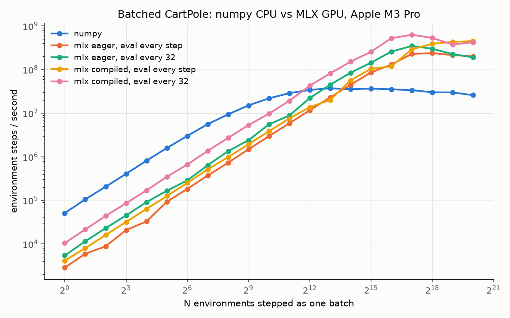

**The crossover is between N = 2,048 and N = 4,096.** Below it the CPU wins,
by about 5x at N = 1. Above it the GPU wins, peaking at **19x at N = 131,072**
(628M environment steps per second against 34M) and holding **17x at
N = 1,048,576**.

What the sweep shows beyond the headline:

- **Per-step dispatch overhead is the whole story at small N.** At N = 1 the
  best GPU configuration spends 95 µs per step; numpy spends 20 µs. That cost
  is per step, not per environment, so it amortises linearly with N, which is
  why every GPU line climbs at slope 1 until the kernels themselves start to
  cost something.
- **Where the eval boundary goes is worth 2x to 2.5x at small N and nothing
  at large N.** Chaining 32 lazy steps before one `mx.eval` lets the GPU
  work while Python builds the next graph. Once kernels dominate, the boundary
  stops mattering; past N = 262K the eager compiled variant is slightly ahead.
- **`mx.compile` is worth 1.5x to 2.2x everywhere.** It fuses the ~20 tiny
  elementwise ops in a step into a few kernels. Compile alone moves the
  crossover from N ≈ 8K (naive port) to N ≈ 4K.
- **A naive port loses until N ≈ 16K.** Eager MLX with an eval every step
  crosses numpy between N = 8,192 and 16,384, four times later than the best
  configuration. The technique is not "put it on the GPU"; it is the eval
  boundary and compile.
- **Memory layout was worth 1.6x on the GPU at large N, and 1.2x to 1.3x on
  the CPU.** The first version stored state as (N, 4) and read each variable
  as a column, a strided view. Stored as (4, N), each variable is a contiguous
  row. A same-session A/B on the whole step, old modules from git history
  against new: numpy 1.2x to 1.3x faster at N ≥ 16K; compiled MLX 1.6x faster
  at N = 1M and unchanged below 131K. The first sweep's GPU throughput had
  collapsed from 603M at N = 131K to 282M at N = 1M; that collapse was the
  layout, not the hardware. The first sweep is kept as
  `results/steps_per_sec_layout_n4.csv`.
- numpy peaks at 37M steps per second around N = 8K and declines slowly after,
  where the working set leaves cache. Not investigated.

### Table

Apple M3 Pro, macOS 26.4, Python 3.13.5, mlx 0.32.2, numpy 2.5.3, on AC
power, with a browser, an IDE, a terminal and an Android emulator open.
Median of 3 runs of 256 timed steps each, after 16 untimed warm-up steps.
Full data in `results/steps_per_sec.csv`; `uv run bench.py` regenerates
all of it in a few minutes.

| N | numpy | mlx eager, eval every step | mlx eager, eval every 32 | mlx compiled, eval every step | mlx compiled, eval every 32 | best MLX / numpy |
|--:|--:|--:|--:|--:|--:|--:|
| 1 | 51,124 | 2,871 | 5,450 | 4,158 | 10,515 | 0.21x |
| 2 | 105,068 | 5,938 | 11,490 | 8,007 | 21,481 | 0.20x |
| 4 | 205,169 | 8,823 | 23,079 | 16,035 | 43,980 | 0.21x |
| 8 | 405,170 | 20,806 | 45,109 | 31,888 | 85,798 | 0.21x |
| 16 | 812,188 | 32,825 | 90,859 | 63,730 | 169,399 | 0.21x |
| 32 | 1,586,867 | 92,817 | 166,267 | 125,536 | 347,899 | 0.22x |
| 64 | 3,006,721 | 183,027 | 287,493 | 251,733 | 663,112 | 0.22x |
| 128 | 5,576,306 | 370,559 | 637,306 | 512,871 | 1,358,351 | 0.24x |
| 256 | 9,400,109 | 729,404 | 1,344,245 | 978,561 | 2,707,540 | 0.29x |
| 512 | 15,073,760 | 1,483,961 | 2,395,398 | 1,930,451 | 5,337,170 | 0.35x |
| 1,024 | 21,822,527 | 2,960,862 | 5,534,127 | 3,852,450 | 9,691,195 | 0.44x |
| 2,048 | 28,788,117 | 5,851,072 | 8,817,410 | 7,530,588 | 19,220,618 | 0.67x |
| 4,096 | 34,103,868 | 11,599,747 | 22,224,794 | 13,698,892 | 42,530,816 | 1.25x |
| 8,192 | 37,145,676 | 23,028,703 | 44,832,494 | 20,161,062 | 81,658,568 | 2.20x |
| 16,384 | 35,397,522 | 44,856,348 | 84,568,620 | 56,483,237 | 151,763,854 | 4.29x |
| 32,768 | 36,549,001 | 85,811,548 | 143,582,053 | 104,027,654 | 255,706,392 | 7.00x |
| 65,536 | 35,257,032 | 130,355,680 | 258,658,675 | 118,866,584 | 522,687,270 | 14.83x |
| 131,072 | 33,728,297 | 228,532,791 | 347,480,868 | 290,960,344 | 628,375,847 | 18.63x |
| 262,144 | 30,073,908 | 238,658,334 | 300,690,641 | 388,920,593 | 531,871,672 | 17.69x |
| 524,288 | 29,821,233 | 214,494,032 | 226,420,572 | 430,930,003 | 374,559,882 | 14.45x |
| 1,048,576 | 25,853,650 | 201,065,370 | 190,864,944 | 448,654,361 | 423,491,089 | 17.35x |

### v1 methodology

Fixed before any number existed, so the benchmark could not be tuned toward a
flattering result.

- **steps/sec = N × iterations ÷ wall-clock seconds** of the timed loop.
- **Warm-up iterations are excluded** from the timed region. They also absorb
  `mx.compile` time and allocator warm-up.
- **`mx.eval` is forced before the clock stops**, on everything the
  environment produced: the final state and every reward and done array in
  the window, since a rollout buffer would consume all three. Timing a loop of
  lazy MLX ops measures graph construction, not computation.
- **Random action sampling happens inside the timed loop, on the same device,
  for every backend.** A real loop pays it too.
- **Identical dynamics on both devices**, enforced structurally: the MLX
  module imports its constants from the numpy module, and a parity test feeds
  the same states and actions to both and requires agreement to five decimals.
  Both use the same (4, N) layout.
- **Identical auto-reset semantics.** Terminated environments are reset in
  place with a mask. Both implementations generate a fresh reset state for all
  N every step and select per column. That is wasted work on a CPU and the
  only branch-free shape on a GPU, and the baseline pays it on purpose so the
  comparison isolates the device.
- **The CPU baseline is single-threaded.** numpy elementwise ops do not use
  multiple cores. A hand-parallelised CPU implementation could lift the CPU
  line by up to the core count, which would move the crossover to the right
  but not remove it. The crossover reported here is against one core.
- **The CPU baseline is vectorised numpy over N**, not a Python loop over
  single environments. A per-env loop is a strawman and would flatter the GPU.
- **Power source is part of the environment.** A sweep taken on battery at
  19% came out ~30% slower on every CPU-bound number, numpy and small-N MLX
  alike, while GPU-bound numbers at large N were unchanged. That would have
  overstated the GPU's lead by ~20%, so it was discarded and `bench.py` now
  prints the power source. Two AC-power sweeps five days apart agreed within
  ~3% at small N.
- Each (configuration, N) is repeated three times and the median is reported.
- No 500-step time limit. Under random actions an episode ends in about 20
  steps, so it would never fire.

## v2: does a faster environment train faster?

No. Not this environment, not this policy.

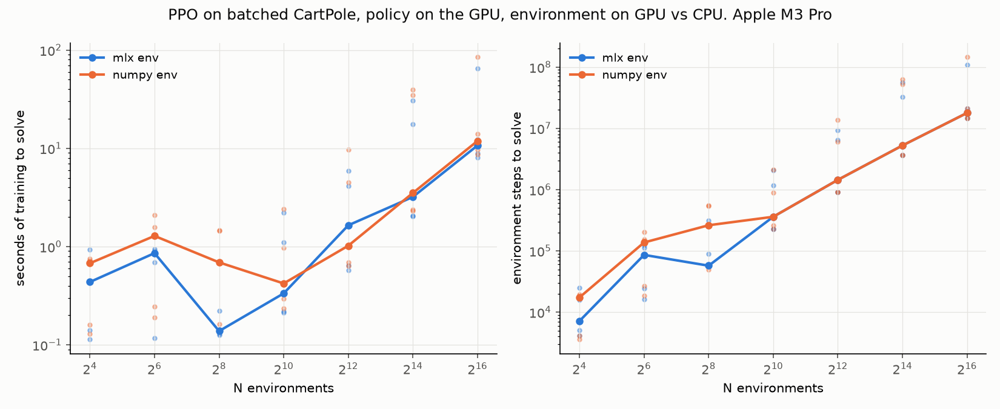

The same PPO, same hyperparameters, same MLP policy on the GPU, with the
environment either on the GPU (MLX; a rollout window is one lazy graph) or on
the CPU (numpy; one host sync per step to hand the action back). Five seeds
per point, median over solved seeds, individual seeds as faint dots.

- **CartPole solves in about 0.1 s of training at N = 256** on either
  backend, and under half a second anywhere from N = 16 to N = 1,024.
- **Where the environment lives changes wall-clock by at most ~1.5x**, and
  seed-to-seed variance is larger than that. The 5x at N = 256 and the 0.6x
  at N = 4,096 in the table are both seed noise; look at the dots, not the
  medians, at those two points.
- **The environment was never the bottleneck.** Profiling one iteration on the
  GPU backend: the PPO update takes about 80% of training time at N = 256 and
  over 90% at N ≥ 4K. The rollout itself is bound by the policy forward pass
  and action sampling, not the physics: at N = 16K it runs at 22M
  environment steps per second while the environment alone does 150M. The
  numpy environment makes the rollout 2.4x slower, and the rollout is a
  minority of the iteration, so the 20x from v1 mostly has nothing to
  accelerate.
- **More environments buy nothing with fixed hyperparameters.** Above
  N = 256, PPO needs about 10 iterations to solve regardless of N, so samples
  to solve grow from 7K at N = 16 to 18M at N = 65,536, and wall-clock grows
  linearly past the sweet spot at N ≈ 256 to 1,024. This is batch-size
  scaling without learning-rate scaling. Nothing was tuned per N, by design;
  a per-N learning rate would be a different experiment.
- **Large N is also less stable.** At N = 65,536 one seed in five failed to
  solve within the 120 s budget on each backend, and at N = 16K two seeds
  took ten times longer than the other three.

### Table

Same machine and conditions as v1. Seconds are training time only, median
over solved seeds; steps likewise. Full per-seed data in `results/ppo.csv`;
`uv run bench_ppo.py` regenerates it in about six minutes.

| N | mlx env: s to solve | mlx env: steps to solve | solved | numpy env: s to solve | numpy env: steps to solve | solved | CPU s / GPU s |
|--:|--:|--:|--:|--:|--:|--:|--:|
| 16 | 0.4 | 7,168 | 5/5 | 0.7 | 17,408 | 5/5 | 1.55x |
| 64 | 0.9 | 86,016 | 5/5 | 1.3 | 137,216 | 5/5 | 1.50x |
| 256 | 0.1 | 57,344 | 5/5 | 0.7 | 262,144 | 5/5 | 5.00x |
| 1,024 | 0.3 | 360,448 | 5/5 | 0.4 | 360,448 | 5/5 | 1.26x |
| 4,096 | 1.6 | 1,441,792 | 5/5 | 1.0 | 1,441,792 | 5/5 | 0.62x |
| 16,384 | 3.2 | 5,242,880 | 5/5 | 3.5 | 5,242,880 | 5/5 | 1.10x |
| 65,536 | 10.7 | 17,825,792 | 4/5 | 11.9 | 17,825,792 | 4/5 | 1.11x |

### v2 methodology

- **The clock covers rollout and update only**, and includes the first
  iteration's compile time. The evaluation rollouts that detect "solved" are
  outside it: they cost ~50 ms each and would dominate a 0.1 s run.
- **Solved is Gym's CartPole-v1 criterion evaluated in parallel:** the greedy
  policy, run from reset for 500 steps on 2,048 environments, survives 475
  steps on average.
- **The training environment has no time limit.** Episodes run until failure;
  a 32-step rollout window with value bootstrapping treats it as a continuing
  task.
- **Hyperparameters are CleanRL's CartPole defaults, fixed across N:** 32-step
  windows, 4 epochs, 4 minibatches, Adam at 2.5e-4 with no annealing, clip
  0.2, GAE λ 0.95, γ 0.99, entropy 0.01, value 0.5, grad norm 0.5. Policy and
  value are separate 4-64-64 tanh MLPs.
- **The train step is compiled** with model and optimizer state threaded
  through, the standard MLX pattern. It made the update 1.35x to 1.6x faster,
  which works against the conclusion above, not for it.
- Runs stop at 120 s of training; unsolved seeds are counted in the table and
  excluded from the medians.

## v3: does a hand-written Metal kernel beat `mx.compile`?

Yes, by 1.7x to 2.9x at every N, and it raises the ceiling: **1.25 billion
environment steps per second at N = 1,048,576, 50x the numpy baseline.**

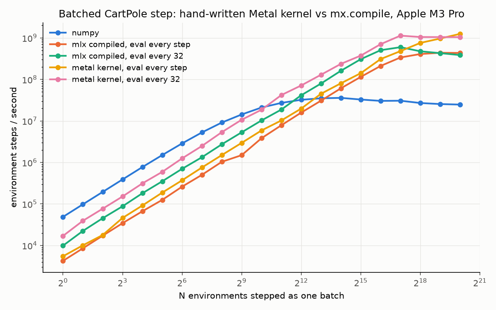

The whole step is one `mx.fast.metal_kernel`: physics, termination, the
masked reset, and the reset's random numbers from an in-kernel PCG hash. One
thread per environment. numpy and the two best v1 configurations were re-run
in the same session, and they reproduce the v1 table within ~5%.

- **At small N the win is dispatch count.** The compiled step still launches
  the reset's random-number generation and the fused arithmetic as separate
  kernels; the hand-written step is one launch, plus the action sampling both
  share. That is 1.7x from N = 1 to N = 64. Per-step overhead drops from
  101 µs to 59 µs with the lazy chain, still three times numpy's 20 µs, so
  the CPU keeps small N.
- **The crossover moves one notch, to between N = 1,024 and 2,048** (from
  2,048 to 4,096). One launch is still one launch; only the constant shrank.
- **At large N the win is memory traffic.** The compiled step materialises
  the (4, N) reset array and the stacked output; the kernel reads four floats
  and an action per environment and writes four floats, a reward and a done.
  That is roughly 45 bytes per environment-step including the sampled
  action, so 1.25 billion steps per second is ~56 GB/s, about a third of the
  M3 Pro's memory bandwidth. Per environment-step the compiled step costs
  2.3 ns at N = 1M; the kernel costs 0.8 ns.
- **Past N ≈ 512K the lazy chain costs more than it saves.** With the kernel,
  evaluating every step beats chaining 32 at N = 1M (1.25B against 1.04B).
  The chain keeps 32 windows of rewards and dones alive, 5 MB each at that
  size, and there is no dispatch overhead left to hide.
- The kernel is 60 lines of Metal. Read `cartpole_metal.py` after the MLX
  module: same formulas, one thread per column of the (4, N) state, and
  ternaries instead of `mx.where`, which the compiler lowers to selects, not
  branches.

### Table

Same machine and conditions as v1, same parameters: median of 3 runs of 256
timed steps after 16 untimed. Full data in `results/kernel.csv`;
`uv run bench_kernel.py` regenerates it in a few minutes.

| N | numpy | mlx compiled, eval every step | mlx compiled, eval every 32 | metal kernel, eval every step | metal kernel, eval every 32 | best kernel / best compiled |
|--:|--:|--:|--:|--:|--:|--:|
| 1 | 48,918 | 4,263 | 9,906 | 5,502 | 17,010 | 1.72x |
| 2 | 97,931 | 8,546 | 22,392 | 10,081 | 39,310 | 1.76x |
| 4 | 195,182 | 17,225 | 45,422 | 17,899 | 77,003 | 1.70x |
| 8 | 389,739 | 34,485 | 87,962 | 46,131 | 151,670 | 1.72x |
| 16 | 774,407 | 66,760 | 181,399 | 91,917 | 313,489 | 1.73x |
| 32 | 1,506,148 | 125,542 | 352,012 | 187,880 | 593,383 | 1.69x |
| 64 | 2,876,173 | 261,357 | 702,803 | 371,482 | 1,252,799 | 1.78x |
| 128 | 5,289,427 | 503,794 | 1,337,101 | 756,668 | 2,496,926 | 1.87x |
| 256 | 9,141,157 | 1,036,208 | 2,735,183 | 1,504,564 | 5,360,234 | 1.96x |
| 512 | 14,305,266 | 1,497,055 | 5,315,633 | 2,961,131 | 10,674,413 | 2.01x |
| 1,024 | 21,023,659 | 3,834,178 | 10,271,782 | 5,898,188 | 18,603,868 | 1.81x |
| 2,048 | 27,167,587 | 7,865,323 | 18,779,008 | 10,267,901 | 41,965,560 | 2.23x |
| 4,096 | 32,295,800 | 15,868,331 | 41,473,764 | 19,827,771 | 71,480,618 | 1.72x |
| 8,192 | 35,092,366 | 30,793,130 | 79,650,278 | 45,175,862 | 129,720,074 | 1.63x |
| 16,384 | 35,914,865 | 61,117,291 | 161,581,694 | 80,572,856 | 236,610,409 | 1.46x |
| 32,768 | 32,754,869 | 115,052,380 | 306,953,168 | 141,288,958 | 374,226,914 | 1.22x |
| 65,536 | 30,376,152 | 211,018,790 | 505,483,737 | 308,944,933 | 705,038,618 | 1.39x |
| 131,072 | 30,661,155 | 337,349,986 | 596,870,312 | 480,073,707 | 1,132,956,168 | 1.90x |
| 262,144 | 27,002,721 | 408,567,298 | 475,230,925 | 756,912,418 | 1,049,329,534 | 2.21x |
| 524,288 | 25,475,443 | 437,805,459 | 428,946,021 | 964,868,911 | 1,045,124,908 | 2.39x |
| 1,048,576 | 24,757,006 | 433,945,335 | 385,705,709 | 1,248,877,786 | 1,044,792,199 | 2.88x |

### v3 methodology

- **The kernel's random numbers are not MLX's.** Resets use a PCG hash of a
  per-call counter and the thread index. Tests check that resets stay in
  bound, differ per call and per environment, and match the uniform
  distribution's mean and standard deviation over 16K samples.
- **The physics parity test is the same one the MLX port passes**, at 1e-4
  instead of 1e-5, because Metal's transcendental functions differ from
  numpy's in the last bits.
- Everything else is v1's rule unchanged: same harness, same iteration
  counts, same eval-boundary sweep, the power source recorded.

## v4: does a heavier body move the crossover?

All the way to N = 1. On Acrobot, the hand-written kernel beats numpy at
every N, including a single environment, and reaches **102x at N = 262,144**.

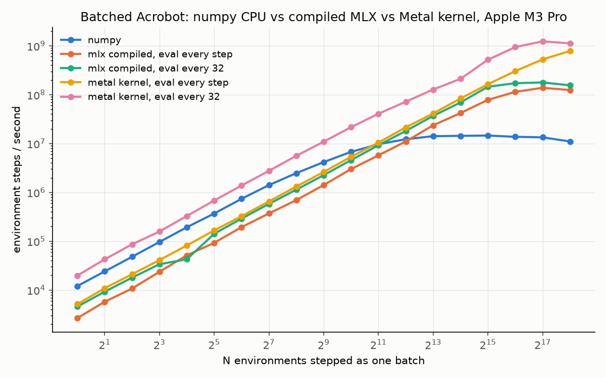

Acrobot (Gym's classic-control version, book dynamics) is a two-link
underactuated pendulum integrated with RK4: four derivative evaluations per
step, about 230 flops and 18 transcendentals against CartPole's ~30 and 2.
Same three implementations, same harness, same tests against a scalar
transcription of Gym's step. The sweep stops at N = 262,144 because numpy
takes minutes per point beyond that and the GPU ceiling is reached by 131K.

| | CartPole | Acrobot |
|---|--:|--:|
| Arithmetic per step, approx. | 30 flops, 2 transcendentals | 230 flops, 18 transcendentals |
| numpy at N = 1 | 20 µs / step | 83 µs / step |
| Metal kernel, eval every 32, at N = 1 | 59 µs / step | 50 µs / step |
| compiled MLX, eval every 32, at N = 1 | 101 µs / step | 218 µs / step |
| First N where the kernel (eval every 32) beats numpy | 2,048 | **1** |
| First N where the kernel (eval every step) beats numpy | 8,192 | 2,048 |
| First N where compiled MLX (eval every 32) beats numpy | 4,096 | 4,096 |
| First N where compiled MLX (eval every step) beats numpy | 16,384 | 8,192 |
| numpy peak | 36M steps/s | 14.6M steps/s |
| compiled MLX peak | 597M steps/s | 178M steps/s |
| Metal kernel peak | 1.13B steps/s | 1.24B steps/s |
| Best GPU / numpy at N = 262,144 | 39x | 102x |

CartPole column from the v3 sweep (`results/kernel.csv`), same harness.

- **The kernel's cost per step did not change; the CPU's did.** At N = 1 the
  kernel spends the same ~50 µs per step on either body, all of it launch
  and sync overhead, while numpy went from 20 µs to 83 µs: four derivative
  evaluations mean four times the numpy calls, and the per-call overhead is
  the cost at small N. At large N the kernel's ceiling is the same ~1.2
  billion steps per second on both bodies, so it is bound by memory traffic
  and scheduling, not arithmetic, and eight times the flops were free.
  numpy's ceiling fell 2.5x.
- **`mx.compile` did not move its crossover.** Still N = 4,096 with the lazy
  chain. Its per-step overhead doubled with the graph, because Python still
  builds ~150 nodes per step before compile sees them, and its ceiling fell
  3.4x, because RK4's four derivative stages with a stack between each do
  not fuse into few kernels. On the heavy body the hand-written kernel is
  7x faster than compile at N = 131K, against 1.9x on CartPole.
- **Body complexity is the lever the v1 handoff predicted.** "Metal dispatch
  overhead dominates for small-body environments; body complexity must
  exceed X before the GPU pays." X is somewhere between CartPole and Acrobot
  for a one-launch step, and the GPU pays at every N past it.
- One wobble: the compiled lazy line dips at N = 16 (43K, below its
  eval-every-step sibling). Median of 3 did not smooth it. Not investigated.

### Table

Same machine and conditions, same parameters: median of 3 runs of 256 timed
steps after 16 untimed, random actions over three torques sampled on the
same device inside the timed loop. Full data in `results/acrobot.csv`;
`uv run bench_acrobot.py --max-exp 18` regenerates it in a few minutes.

| N | numpy | mlx compiled, eval every step | mlx compiled, eval every 32 | metal kernel, eval every step | metal kernel, eval every 32 | best GPU / numpy |
|--:|--:|--:|--:|--:|--:|--:|
| 1 | 12,091 | 2,672 | 4,586 | 5,152 | 19,826 | 1.64x |
| 2 | 24,138 | 5,776 | 9,271 | 10,924 | 42,675 | 1.77x |
| 4 | 48,087 | 10,754 | 18,010 | 21,117 | 86,662 | 1.80x |
| 8 | 96,685 | 23,738 | 33,828 | 41,163 | 158,076 | 1.63x |
| 16 | 193,358 | 51,521 | 42,880 | 81,872 | 328,891 | 1.70x |
| 32 | 369,649 | 92,836 | 142,079 | 166,610 | 682,837 | 1.85x |
| 64 | 739,243 | 194,696 | 291,183 | 326,395 | 1,380,267 | 1.87x |
| 128 | 1,410,828 | 370,950 | 580,678 | 653,883 | 2,763,638 | 1.96x |
| 256 | 2,476,354 | 695,635 | 1,137,766 | 1,319,346 | 5,604,581 | 2.26x |
| 512 | 4,170,366 | 1,414,530 | 2,251,883 | 2,616,758 | 10,921,794 | 2.62x |
| 1,024 | 6,748,158 | 3,002,369 | 4,578,008 | 5,353,251 | 21,634,175 | 3.21x |
| 2,048 | 9,683,573 | 5,737,061 | 9,221,020 | 10,452,990 | 40,694,665 | 4.20x |
| 4,096 | 12,259,835 | 11,038,334 | 18,131,337 | 21,453,125 | 71,946,348 | 5.87x |
| 8,192 | 14,147,339 | 23,655,992 | 36,739,636 | 41,235,440 | 127,707,373 | 9.03x |
| 16,384 | 14,363,551 | 42,070,197 | 69,376,409 | 83,624,961 | 211,273,340 | 14.71x |
| 32,768 | 14,575,287 | 78,369,275 | 145,325,540 | 163,679,224 | 519,945,643 | 35.67x |
| 65,536 | 13,731,650 | 114,124,187 | 171,921,631 | 304,011,946 | 941,612,312 | 68.57x |
| 131,072 | 13,386,064 | 138,567,930 | 178,035,263 | 528,293,189 | 1,237,181,816 | 92.42x |
| 262,144 | 11,017,745 | 124,226,980 | 155,354,617 | 783,596,062 | 1,122,857,104 | 101.91x |

### v4 methodology

- **Same rule as v1**, with the sweep stopping at 2^18 for the reason above.
- **Same tests as CartPole:** every implementation agrees with a scalar
  transcription of Gym's `AcrobotEnv.step`, including its RK4 on the
  torque-augmented state and its while-loop angle wrap, at 1e-3, the RK4
  step at dt = 0.2 amplifying float32 rounding. Angle wrap is branch-free
  (`x - 2π·floor((x + π) / 2π)`), which differs from Gym only at the exact
  boundary.
- **Acrobot almost never terminates under random actions**, so the masked
  reset is paid every step and almost never used, on every backend. Reward
  is Gym's: -1 per step, 0 on termination.
- The flop counts are hand counts of the Python source with constant folding
  and are approximate.

## v5: can large N be made to pay in PPO?

No. Not with the standard remedies, and not for the reason I expected.

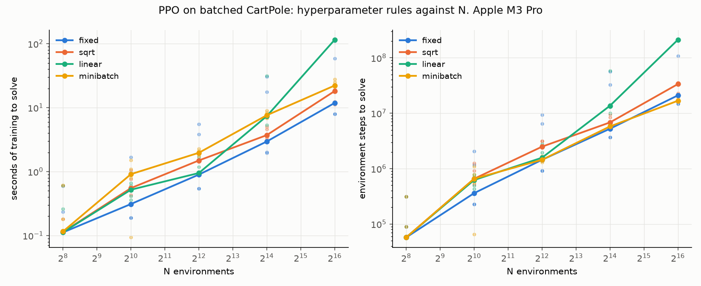

v2 left a loose end: with fixed hyperparameters PPO needed about ten
iterations to solve CartPole regardless of N, so every environment past
N ≈ 256 was pure cost. v5 sweeps the three standard remedies against that
baseline, on the GPU environment, same solved criterion, five seeds:
learning rate scaled with √N (Hoffer et al.), learning rate scaled linearly
with N (Goyal et al.), and a fixed 2,048-sample minibatch so gradient steps
per sample stay constant. All four rules coincide at N = 256, which anchors
the sweep.

- **No rule beats the fixed baseline in wall-clock at any N.** The overall
  minimum is unchanged: N = 256, a tenth of a second. Sqrt scaling costs
  1.3x to 1.6x the baseline's median time, fixed minibatches about 2x.
  Linear scaling matches the baseline to N = 4,096, loses a seed at 16,384,
  and destroys the policy at 65,536, where four of five seeds sit at the
  untrained score after the full budget.
- **What the rules buy is robustness, not speed.** At N = 65,536 the
  baseline's five seeds took between 8 and 110 seconds; sqrt's took 11 to
  19, minibatch's 22 to 28. A five to ten times smaller spread, for about
  twice the median.
- **The iteration count is the invariant.** Median iterations to solve over
  solved seeds:

  | N | fixed | sqrt | linear | minibatch |
  |--:|--:|--:|--:|--:|
  | 256 | 7 | 7 | 7 | 7 |
  | 1,024 | 11 | 20 | 19 | 20 |
  | 4,096 | 11 | 19 | 12 | 11 |
  | 16,384 | 10 | 13 | 26 | 11 |
  | 65,536 | 10 | 16 | 101 | 8 |

  Ten iterations at every N above 256 for the baseline, and no rule cuts
  that below 8 anywhere. Not a 16x larger learning rate, not 256x more
  gradient steps per iteration.
- **It is not the clip, and it is not the window.** Two diagnostic arms,
  in `results/lr_diag.csv`: the minibatch rule with clip 0.5 instead of 0.2,
  so a wider trust region with thousands of steps to reach it, and the
  baseline with a 128-step rollout window instead of 32.

| N | fixed: iterations | clip0.5: iterations | window128: iterations |
|--:|--:|--:|--:|
| 4,096 | 11 | 11 | 11 |
| 16,384 | 10 | 11 | 11 |
| 65,536 | 10 | 12 | 7 |

  Neither moves the floor. The wider clip still takes 11 to 12. The longer
  window still takes 11, and 7 at N = 65,536 only with two of five seeds
  failing and four times the samples per iteration.
- **What is left is on-policy data collection itself.** Each iteration can
  only teach the policy about states its current competence reaches,
  because the episode ends where competence ends. CartPole appears to need
  about ten rounds of act-then-learn, and nothing inside one round, not step
  size, not step count, not trust region, not window length, substitutes for
  the next round's data. That is the remaining hypothesis. It was not tested
  further.
- **So the right N for PPO here is the smallest one whose gradient is good
  enough, about 256 to 1,024.** More environments buy variance reduction and
  nothing else. The 20x environment from v1 and the 1.2 billion steps per
  second from v3 have nowhere to go in this algorithm on this task. They
  would matter for a method that reuses data, or for a task where one round
  of data is the expensive part.

### Tables

Same machine and conditions. Seconds are training time, median over solved
seeds; unsolved seeds are counted. `uv run bench_lr.py` regenerates the main
sweep in about 40 minutes. The diagnostic arms are
`uv run bench_lr.py --rules fixed clip0.5 window128 --ns 4096 16384 65536 --out lr_diag`.

| N | fixed: s to solve | fixed: steps to solve | solved | sqrt: s to solve | sqrt: steps to solve | solved | linear: s to solve | linear: steps to solve | solved | minibatch: s to solve | minibatch: steps to solve | solved |
|--:|--:|--:|--:|--:|--:|--:|--:|--:|--:|--:|--:|--:|
| 256 | 0.1 | 57,344 | 5/5 | 0.1 | 57,344 | 5/5 | 0.1 | 57,344 | 5/5 | 0.1 | 57,344 | 5/5 |
| 1,024 | 0.3 | 360,448 | 5/5 | 0.6 | 655,360 | 5/5 | 0.5 | 622,592 | 5/5 | 0.9 | 655,360 | 5/5 |
| 4,096 | 0.9 | 1,441,792 | 5/5 | 1.5 | 2,490,368 | 5/5 | 0.9 | 1,572,864 | 5/5 | 2.0 | 1,441,792 | 5/5 |
| 16,384 | 3.0 | 5,242,880 | 5/5 | 3.7 | 6,815,744 | 5/5 | 7.4 | 13,631,488 | 4/5 | 7.6 | 5,767,168 | 5/5 |
| 65,536 | 11.8 | 20,971,520 | 5/5 | 18.2 | 33,554,432 | 5/5 | 115.2 | 211,812,352 | 1/5 | 22.2 | 16,777,216 | 5/5 |

Diagnostic arms:

| N | fixed: s to solve | fixed: steps to solve | solved | clip0.5: s to solve | clip0.5: steps to solve | solved | window128: s to solve | window128: steps to solve | solved |
|--:|--:|--:|--:|--:|--:|--:|--:|--:|--:|
| 4,096 | 0.9 | 1,441,792 | 5/5 | 2.0 | 1,441,792 | 5/5 | 3.3 | 5,767,168 | 5/5 |
| 16,384 | 2.9 | 5,242,880 | 5/5 | 7.8 | 5,767,168 | 5/5 | 12.8 | 23,068,672 | 5/5 |
| 65,536 | 11.9 | 20,971,520 | 5/5 | 33.2 | 25,165,824 | 5/5 | 33.6 | 58,720,256 | 3/5 |

### v5 methodology

- **Every rule is a plain configuration of `ppo.py`**; no training code
  changed. Reference N is 256, the v2 sweet spot. The fixed minibatch is
  2,048 samples, exactly v2's minibatch at N = 256.
- Same clock, same solved criterion, same 120 s budget as v2.
- **At N = 1,024 the differences between rules are within seed noise**; the
  per-seed dots on the plot overlap. The conclusions rest on N ≥ 4,096.
- The fixed-minibatch rule at N = 65,536 runs 4,096 gradient steps per
  iteration, each followed by an eval, and costs only 2.3x the 16-step
  baseline per iteration, because a 2,048-sample step is mostly launch
  overhead.

## v6: does an off-policy learner use the environment?

Partly. DQN uses the fresh data up to N ≈ 256, the GPU environment finally
shows up in training wall-clock, and then the learner's read rate becomes
the ceiling, two hundred times below what the environment can produce.

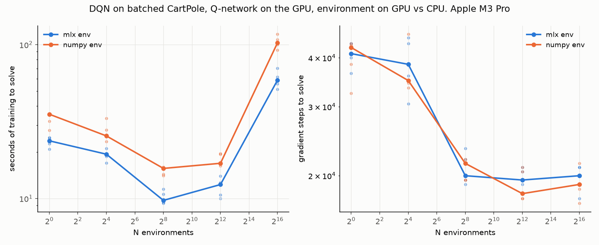

DQN with CleanRL's CartPole hyperparameters, a 100K-transition replay buffer
as five GPU arrays, and a compiled train step. Each iteration is one batched
environment step, N transitions into the buffer, and one gradient step on a
128-sample batch. Epsilon decay, learning start and target sync are
scheduled in gradient steps and buffer fill, so the learner sees the same
schedule at every N. Five seeds, both environment backends.

- **Fresh data pays, up to N ≈ 256.** Gradient steps to solve fall from
  41,000 at N = 1 to 20,000 at N = 256, then plateau: 19,500 at 4,096,
  20,000 at 65,536. The learner reads 128 transitions per step; past
  N ≈ 256 the extra transitions are never sampled. This is the shape v5
  could not produce. Off-policy learning converts more data into fewer
  steps, until the learner is reading as fast as it can.
- **Wall-clock bottoms at N = 256, 2.4x faster than one environment**, 9.7 s
  against 23.7 s. Past the plateau every environment is cost again:
  N = 65,536 takes 59 s, because the iteration is six times more expensive
  (65,536 rows scattered into the buffer, a Q forward pass on all of them)
  and buys nothing.
- **The environment's location matters for the first time**: the CPU
  environment costs 1.3x to 1.75x at every N, outside seed spread. One
  gradient step per environment step is a far higher environment-to-learner
  ratio than PPO's sixteen per thirty-two. At N = 256 the numpy step and its
  host sync add 0.24 ms to a 0.49 ms iteration.
- **Reading more per step helps, up to 1,024.** A second sweep on the GPU
  environment with batch sizes 128, 1,024 and 8,192 (`results/dqn_batch.csv`):

| N | batch 128: s to solve | batch 128: gradient steps to solve | solved | batch 1024: s to solve | batch 1024: gradient steps to solve | solved | batch 8192: s to solve | batch 8192: gradient steps to solve | solved |
|--:|--:|--:|--:|--:|--:|--:|--:|--:|--:|
| 256 | 9.7 | 20,000 | 5/5 | 7.8 | 13,500 | 5/5 | 20.2 | 14,500 | 5/5 |
| 4,096 | 11.1 | 19,500 | 5/5 | 11.6 | 16,500 | 5/5 | 15.6 | 10,500 | 5/5 |

  Batch 1,024 cuts gradient steps by a third at almost no cost per iteration
  and sets the project's best training time, **7.8 s at N = 256, three times
  faster than a single environment**. Batch 8,192 needs fewer steps still but
  triples the cost of each, and at N = 256 it is resampling a buffer that
  turns over slowly, with the widest seed spread in the sweep.
- **The ceiling is the learner's read rate.** Samples read per second: 260K
  at batch 128, 1.8M at 1,024, 5.9M at 8,192. The environment produces 1.2
  billion. At its best DQN reads half a percent of what the environment can
  make, and past batch 1,024 the extra reads stop paying. The remaining
  throughput has one kind of customer: a learner with no gradient step,
  where every environment runs its own policy and the environment is the
  inner loop. That is a different project.

### Table

Same machine and conditions. Seconds are training time, median over solved
seeds. `uv run bench_dqn.py` regenerates the main sweep in about twenty
minutes; the batch sweep is
`uv run bench_dqn.py --backends mlx --batches 128 1024 8192 --ns 256 4096 --series batch --out dqn_batch`.

| N | mlx env: s to solve | mlx env: gradient steps to solve | solved | numpy env: s to solve | numpy env: gradient steps to solve | solved | CPU s / GPU s |
|--:|--:|--:|--:|--:|--:|--:|--:|
| 1 | 23.7 | 41,000 | 5/5 | 35.3 | 42,500 | 5/5 | 1.49x |
| 16 | 19.4 | 38,500 | 5/5 | 25.5 | 35,000 | 5/5 | 1.31x |
| 256 | 9.7 | 20,000 | 5/5 | 15.7 | 21,500 | 5/5 | 1.61x |
| 4,096 | 12.3 | 19,500 | 5/5 | 16.9 | 18,000 | 5/5 | 1.37x |
| 65,536 | 58.8 | 20,000 | 5/5 | 102.9 | 19,000 | 5/5 | 1.75x |

### v6 methodology

- **Same clock and solved criterion as v2 and v5.** The evaluation rollout
  runs every 500 gradient steps and is outside the clock, so solve times
  have a resolution of about a quarter second.
- **Three CleanRL settings are re-expressed** so the schedule is identical
  at every N: epsilon decays over 25,000 gradient steps (CleanRL's 250K env
  steps at one gradient step per ten), the target network syncs every 50
  gradient steps (500 per 10), learning starts at 10,000 buffered
  transitions. The buffer is 100K for every N; CleanRL's 10K would hold less
  than one iteration at N = 65,536. At N = 65,536 the buffer holds 1.5
  iterations, so the learner is nearly on-policy there.
- **The compiled train step threads the online network, the target network
  and the optimizer state as inputs.** The target network changes every 50
  steps; a captured array is a constant to compile. Fourth appearance of
  v1's trap.
- The Q-network is CleanRL's 120-84 ReLU MLP. Every rule is a configuration
  of `dqn.py`; no training code differs between arms.

## v7: the learner whose inner loop is the environment

Evolution Strategies, and it is the fastest solve in the project by five
times: **CartPole in about 20 milliseconds of training**, at any population
from 64 to 4,096, with the whole rollout as one kernel launch per
generation. It is also the first learner that runs the environment at the
environment's own ceiling.

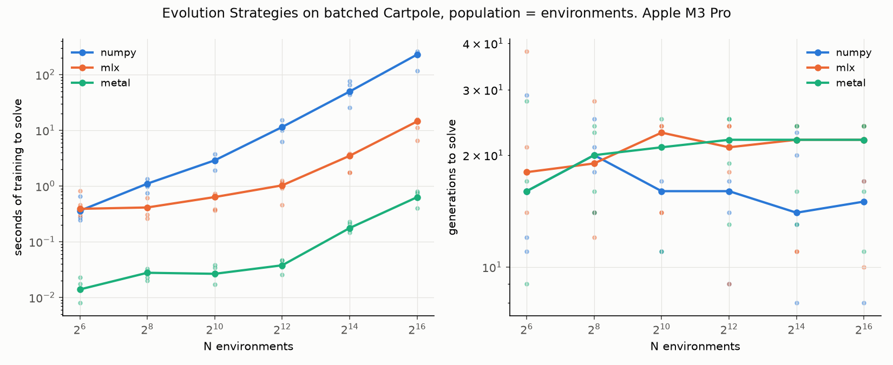

OpenAI-style ES (Salimans et al. 2017): antithetic perturbations of a mean
policy, fitness ranked and normalised, one weighted-sum update per
generation, no gradient anywhere. The population is the batch of
environments; each member is a 4-32-2 MLP with its own weights. Three
backends with identical arithmetic: numpy, everything on the CPU; mlx, the
natural port, MLX ops for the population's policy and the v3 step kernel;
and metal, one thread per member running its policy and the physics for the
full 500-step horizon in registers and writing back one number
(`cartpole_rollout_metal.py`). Five seeds, median over solved seeds.

- **One kernel launch per generation is worth 15x to 28x over the same
  algorithm in MLX ops, and 26x to 364x over the CPU.** The ops version
  reads every member's 900 bytes of weights and writes its state on every
  step; the fused kernel reads the weights once. Its generation costs about
  1.5 ms up to a population of 4,096, nearly all of it sampling, ranking and
  the update rather than the rollout, and CartPole takes about 20 of them.
- **Population size buys nothing past a few thousand.** Generations to
  solve are 14 to 23 at every population on every backend, the seed spread
  wider than any difference between sizes. From 65,536 members to a million
  the per-seed generation counts are all but identical, 10 or 11 to 24: each seed's initial policy is
  the same first draw, and once the population is large the rank-normalised
  update is the smoothed gradient itself, so the trajectory no longer
  depends on which members were sampled. Wall-clock is flat to 4,096 and
  linear after.
- **A larger population does not permit larger steps either.** Step sizes
  0.3 and 1.0 take 22 to 26 generations against 20 to 22 at 0.1, at every
  population tried (`results/es_lr.csv`). Below 0.1 the count grows as the
  step shrinks, 39 at 0.05 and 87 at 0.02 in the one-seed check; above it
  the count is flat. The floor of about 20 generations is not a step-size
  limit.
- **The learner consumes the environment.** Counting only steps a member
  took before its first termination, the kernel backend runs 200M
  environment steps per second at a population of 4,096 and 155M to 182M
  from 16K to a million, where sampling and reducing up to a gigabyte of
  perturbations per generation is the cost. DQN's best read rate was 5.9M,
  PPO's rollout about 20M. Counted nominally as population times horizon,
  the kernel drives the environment at 1.1B steps per second from 4,096
  members to a million, the standalone step kernel's own ceiling from v3.
- **The CPU falls out of the race.** numpy takes 50 s at 16,384 and misses
  the 300 s budget on two seeds of five at 65,536; the kernel takes 0.18 s
  and 0.63 s. This is the one learner where the environment's speed is the
  whole story, and the 282x to 364x between the two at large populations is
  v4's kind of number arriving in training time.
- The kernel rows in every v7 table were re-run after v8 found that per-step
  weight reads bounded the kernel at large populations and moved each
  member's weights into thread-private memory; the numpy and mlx rows are
  the original run. Below 4,096 members nothing changed.

### Tables

Same machine and conditions. Seconds are training time, median over solved
seeds; the evaluation of the mean policy runs every generation outside the
clock. `uv run bench_es.py` regenerates the main sweep in about 45 minutes,
most of it the CPU backend; `--backends metal --ns 262144 1048576 --out es_big`
and `--backends metal --lrs 0.1 0.3 1.0 --ns 256 4096 65536 --series lr --out es_lr`
are the two follow-ups.

| N | numpy: s to solve | numpy: generations to solve | solved | mlx: s to solve | mlx: generations to solve | solved | metal: s to solve | metal: generations to solve | solved |
|--:|--:|--:|--:|--:|--:|--:|--:|--:|--:|
| 64 | 0.359 | 16 | 5/5 | 0.388 | 18 | 5/5 | 0.0139 | 16 | 5/5 |
| 256 | 1.1 | 20 | 5/5 | 0.411 | 19 | 5/5 | 0.0276 | 20 | 5/5 |
| 1,024 | 2.88 | 16 | 5/5 | 0.632 | 23 | 5/5 | 0.0265 | 21 | 5/5 |
| 4,096 | 11.4 | 16 | 5/5 | 1.02 | 21 | 5/5 | 0.0376 | 22 | 5/5 |
| 16,384 | 49.6 | 14 | 5/5 | 3.48 | 22 | 5/5 | 0.176 | 22 | 5/5 |
| 65,536 | 229 | 15 | 3/5 | 14.4 | 22 | 5/5 | 0.629 | 22 | 5/5 |

Per-seed spread:

| P | numpy: seconds, min..max | numpy: generations, min..max | mlx: seconds, min..max | mlx: generations, min..max | metal: seconds, min..max | metal: generations, min..max |
|--:|--:|--:|--:|--:|--:|--:|
| 64 | 0.246..0.658 | 11..29 | 0.301..0.823 | 14..38 | 0.00791..0.0227 | 9..28 |
| 256 | 0.751..1.35 | 14..25 | 0.26..0.604 | 12..28 | 0.0199..0.0329 | 14..24 |
| 1,024 | 1.92..3.73 | 11..21 | 0.368..0.723 | 14..24 | 0.017..0.038 | 11..25 |
| 4,096 | 6.27..15.2 | 9..21 | 0.452..1.24 | 9..24 | 0.0255..0.0469 | 13..25 |
| 16,384 | 25.5..76 | 8..23 | 1.74..3.8 | 11..24 | 0.147..0.229 | 13..24 |
| 65,536 | 117..258 | 8..17 | 6.54..15.7 | 10..24 | 0.402..0.804 | 11..24 |

Environment steps per second consumed by the learner, median over seeds.
"Steps taken" counts a member's steps to its first termination; "P×H×gens"
is the nominal population times horizon, which is what the two loop
backends actually execute, terminated members included:

| P | numpy: steps taken / s | numpy: P×H×gens / s | mlx: steps taken / s | mlx: P×H×gens / s | metal: steps taken / s | metal: P×H×gens / s |
|--:|--:|--:|--:|--:|--:|--:|
| 64 | 0.2M | 1.4M | 0.3M | 1.5M | 6.8M | 36.9M |
| 256 | 0.5M | 2.4M | 0.9M | 5.9M | 17.4M | 90.8M |
| 1,024 | 0.5M | 2.9M | 3.3M | 18.8M | 59.4M | 336.4M |
| 4,096 | 0.5M | 2.9M | 6.9M | 40.8M | 198.6M | 1,110.6M |
| 16,384 | 0.4M | 2.5M | 8.3M | 51.7M | 154.9M | 859.4M |
| 65,536 | 0.4M | 2.1M | 8.4M | 50.1M | 171.1M | 977.6M |

The kernel backend alone at larger populations:

| N | metal: s to solve | metal: generations to solve | solved |
|--:|--:|--:|--:|
| 262,144 | 2.51 | 21 | 5/5 |
| 1,048,576 | 9.92 | 21 | 5/5 |

| P | metal: steps taken / s | metal: P×H×gens / s |
|--:|--:|--:|
| 262,144 | 181.7M | 1,055.0M |
| 1,048,576 | 182.3M | 1,083.3M |

Step size against population, kernel backend:

| N | lr 0.1: s to solve | lr 0.1: generations to solve | solved | lr 0.3: s to solve | lr 0.3: generations to solve | solved | lr 1.0: s to solve | lr 1.0: generations to solve | solved |
|--:|--:|--:|--:|--:|--:|--:|--:|--:|--:|
| 256 | 0.0278 | 20 | 5/5 | 0.0223 | 23 | 5/5 | 0.0214 | 26 | 5/5 |
| 4,096 | 0.0376 | 22 | 5/5 | 0.0386 | 25 | 5/5 | 0.0339 | 26 | 5/5 |
| 65,536 | 0.625 | 22 | 5/5 | 0.644 | 24 | 5/5 | 0.541 | 22 | 5/5 |

### v7 methodology

- **Hyperparameters were fixed from a one-seed check at population 256**:
  step size 0.1 and noise scale 0.1, from trying 0.02, 0.05 and 0.1 for the
  step and 0.05 and 0.1 for the noise. The same values are used at every
  population and on every backend; the step-size sweep above is the only
  place they vary.
- **Fitness is steps survived over a 500-step horizon from a fresh reset.**
  The kernel ends a member's episode at its first termination; the loop
  backends keep stepping terminated members to the horizon, with auto-reset,
  because that is the shape a batched step has. A test runs both on the same
  population and initial states and requires the same survival count for
  over 95% of members; the rest differ because a last-bit difference in
  `tanh` can flip a near-tie action and the trajectory is chaotic.
- **Environment steps are counted as steps taken**, so all three backends
  are measured on the same quantity; the nominal count is shown alongside.
- Time budget 300 s, three times the other learners', so the CPU backend
  could finish at 16,384 members; it still could not at 65,536.
- The mean policy is evaluated with the same greedy criterion as every
  learner in this repo, on the GPU environment, for every backend.

## v8: ES on the heavier body

Faster than CartPole. **Acrobot to Gym's threshold in 11 to 20 milliseconds
of training**, four to seven generations, at any population from 64 to
4,096, and **8 ms with a larger step**. The sparse fitness I expected to
need a large population needs none.

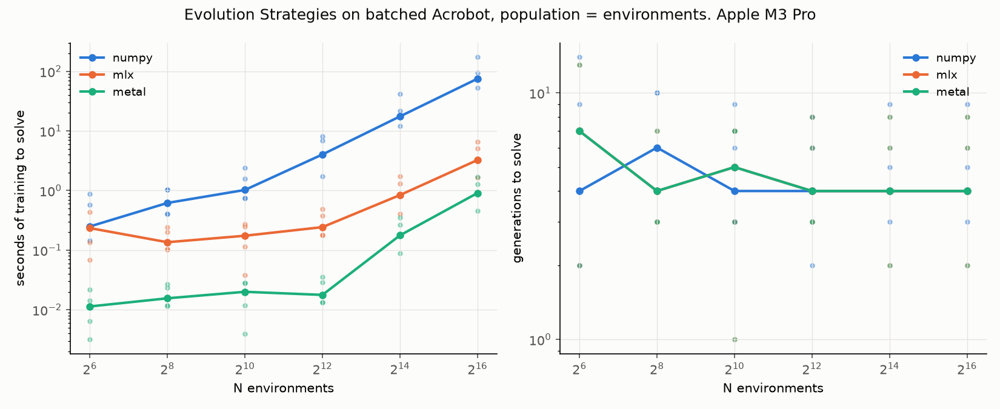

Same learner, same three backends, a second fused rollout kernel with the
RK4 physics inline. The policy sees Gym's six-dimensional observation, the
cosine and sine of both angles and the two velocities, through a 6-32-3
MLP. Fitness is minus the steps to reach the top, the horizon if it never
does. Solved is Gym's Acrobot-v1 threshold, a return of -100: the greedy
mean policy reaches the top within 100 steps on average over 2,048
episodes. Five seeds, hyperparameters unchanged from CartPole.

- **Population size buys nothing here either, and the sparse-fitness worry
  was wrong.** Four to seven generations at every size from 64 to a
  million, several seeds in one or two. A randomly weighted tanh MLP acts
  nearly bang-bang and pumps energy into the pendulum by accident, so even
  64 members contain a few that reach the top in the first generation, and
  a few is all the rank-normalised update needs.
- **A larger step does help on Acrobot, unlike CartPole.** Step size 0.3
  halves generations to two or three at every population with a tight
  spread (`results/es_acrobot_lr.csv`), and gives the best solve in the
  project: 7.8 ms median at 256 members. Step 1.0 is fastest in median but
  one seed in five wanders for 17 to 186 generations, and a population of
  65,536 does not make it safe; its spread is as wide as at 256.
- **The kernel's margin is 9x to 21x over MLX ops up to 4,096 members and
  4x to 5x above**, where the Acrobot rollout, 2.4x slower per step than
  CartPole's for 8x the arithmetic, has become the cost. Over the CPU it is
  22x to 228x.
- **The kernel's bottleneck at large populations was reading weights.** At
  65,536 members the rollout spent four fifths of its time reading each
  member's 323 weights from device memory on every step. Copying them into
  thread-private memory once per thread made it 4x faster on Acrobot and
  2.2x on CartPole at that size, with no change below 4,096 and identical
  results. It is the v3 lesson a third time: the arithmetic was never the
  cost.
- **Throughput.** 412M useful environment steps per second at 4,096 members
  (460M nominal), 118M to 164M from 16K to a million; numpy 1.7M, mlx 35M.

### Tables

Same machine and conditions. Seconds are training time, median over solved
seeds; time budget 300 s. `uv run bench_es.py --task acrobot --time-budget 300`
regenerates the main sweep in about 25 minutes; the follow-ups add
`--backends metal --ns 262144 1048576 --out es_acrobot_big` and
`--backends metal --lrs 0.1 0.3 1.0 --ns 256 4096 65536 --series lr --out es_acrobot_lr`.

| N | numpy: s to solve | numpy: generations to solve | solved | mlx: s to solve | mlx: generations to solve | solved | metal: s to solve | metal: generations to solve | solved |
|--:|--:|--:|--:|--:|--:|--:|--:|--:|--:|
| 64 | 0.25 | 4 | 5/5 | 0.234 | 7 | 5/5 | 0.0113 | 7 | 5/5 |
| 256 | 0.619 | 6 | 5/5 | 0.136 | 4 | 5/5 | 0.0156 | 4 | 5/5 |
| 1,024 | 1.02 | 4 | 5/5 | 0.174 | 5 | 5/5 | 0.02 | 5 | 5/5 |
| 4,096 | 4.03 | 4 | 5/5 | 0.243 | 4 | 5/5 | 0.0177 | 4 | 5/5 |
| 16,384 | 17.5 | 4 | 5/5 | 0.839 | 4 | 5/5 | 0.177 | 4 | 5/5 |
| 65,536 | 75.2 | 4 | 5/5 | 3.25 | 4 | 5/5 | 0.907 | 4 | 5/5 |

Per-seed spread:

| P | numpy: seconds, min..max | numpy: generations, min..max | mlx: seconds, min..max | mlx: generations, min..max | metal: seconds, min..max | metal: generations, min..max |
|--:|--:|--:|--:|--:|--:|--:|
| 64 | 0.144..0.874 | 2..14 | 0.0683..0.435 | 2..13 | 0.00317..0.0216 | 2..13 |
| 256 | 0.403..1.04 | 4..10 | 0.102..0.242 | 3..7 | 0.0114..0.027 | 3..7 |
| 1,024 | 0.742..2.42 | 3..9 | 0.0384..0.274 | 1..7 | 0.00396..0.0283 | 1..7 |
| 4,096 | 1.73..8.18 | 2..8 | 0.178..0.486 | 3..8 | 0.0132..0.0356 | 3..8 |
| 16,384 | 12.1..41.7 | 3..9 | 0.403..1.72 | 2..8 | 0.0886..0.351 | 2..8 |
| 65,536 | 53.4..175 | 3..9 | 1.67..6.62 | 2..8 | 0.458..1.67 | 2..8 |

Environment steps per second consumed, median over seeds, steps taken and
nominal as in v7:

| P | numpy: steps taken / s | numpy: P×H×gens / s | mlx: steps taken / s | mlx: P×H×gens / s | metal: steps taken / s | metal: P×H×gens / s |
|--:|--:|--:|--:|--:|--:|--:|
| 64 | 0.4M | 0.5M | 0.8M | 1.0M | 15.4M | 19.7M |
| 256 | 1.0M | 1.2M | 3.3M | 3.8M | 29.2M | 33.0M |
| 1,024 | 1.7M | 2.0M | 11.8M | 13.4M | 111.8M | 128.0M |
| 4,096 | 1.8M | 2.0M | 30.0M | 33.7M | 412.1M | 459.7M |
| 16,384 | 1.7M | 1.9M | 34.2M | 39.1M | 164.3M | 186.1M |
| 65,536 | 1.5M | 1.7M | 34.8M | 39.6M | 132.0M | 148.8M |

The kernel backend alone at larger populations:

| N | metal: s to solve | metal: generations to solve | solved |
|--:|--:|--:|--:|
| 262,144 | 3.93 | 4 | 5/5 |
| 1,048,576 | 14.8 | 4 | 5/5 |

| P | metal: steps taken / s | metal: P×H×gens / s |
|--:|--:|--:|
| 262,144 | 117.5M | 135.1M |
| 1,048,576 | 119.8M | 141.4M |

Step size against population, kernel backend:

| N | lr 0.1: s to solve | lr 0.1: generations to solve | solved | lr 0.3: s to solve | lr 0.3: generations to solve | solved | lr 1.0: s to solve | lr 1.0: generations to solve | solved |
|--:|--:|--:|--:|--:|--:|--:|--:|--:|--:|
| 256 | 0.0154 | 4 | 5/5 | 0.00777 | 2 | 5/5 | 0.0115 | 3 | 5/5 |
| 4,096 | 0.0175 | 4 | 5/5 | 0.0138 | 3 | 5/5 | 0.00486 | 1 | 5/5 |
| 65,536 | 0.893 | 4 | 5/5 | 0.449 | 2 | 5/5 | 0.442 | 2 | 5/5 |

| P | lr 0.1: seconds, min..max | lr 0.1: generations, min..max | lr 0.3: seconds, min..max | lr 0.3: generations, min..max | lr 1.0: seconds, min..max | lr 1.0: generations, min..max |
|--:|--:|--:|--:|--:|--:|--:|
| 256 | 0.0116..0.0366 | 3..7 | 0.00381..0.0271 | 1..7 | 0.00761..0.161 | 2..56 |
| 4,096 | 0.0133..0.0351 | 3..8 | 0.00881..0.0177 | 2..4 | 0.00434..0.075 | 1..17 |
| 65,536 | 0.442..1.78 | 2..8 | 0.447..0.891 | 2..4 | 0.221..41.4 | 1..186 |

### v8 methodology

- **Nothing was re-tuned.** Step size 0.1 and noise 0.1 come from v7's
  one-seed check on CartPole; the step-size sweep is the only place they
  vary. Hidden width 32, horizon 500, as before.
- **Same fitness test as v7 on this body**: the fused kernel and the
  step-by-step loop must agree on steps for over 95% of members from the
  same population and initial states, and some randomly weighted members
  must reach the top within 200 steps.
- **Environment steps are counted as steps taken**; the loop backends keep
  stepping members that reached the top, with auto-reset, and that work is
  not counted, as in v7.
- The evaluation of the mean policy runs every generation, on the GPU
  environment, outside the clock, for every backend.

## v9: how heavy can a body get?

Heavy enough that the GPU pays for arithmetic, which starts at about
Acrobot's weight. Below it the step is bound by memory and launches and
flops are free; above it the kernel's throughput falls nearly in proportion
to the flops, and so does numpy's, so the ratio between them stays near
**100x for any body from Acrobot's weight up**, and the kernel beats numpy
at N = 1 for every body tried.

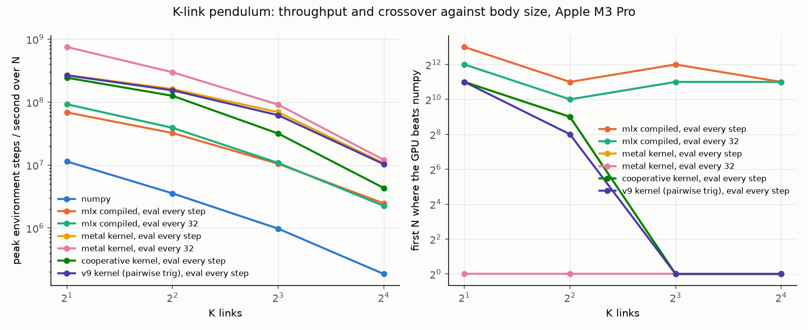

A planar chain of K unit masses on unit rods, torque at the root, gravity:
a K×K mass matrix built from cosines of angle differences, a Cholesky solve
per RK4 stage, angle wrap, velocity clip, Acrobot's termination rule
generalised. K = 2, 4, 8, 16: about 200, 700, 3,000 and 15,000 flops per
step, Acrobot's weight to a hundred times CartPole's. Same three
implementations, same harness, same Cholesky written out as loops over K of
vector operations over N in all three so the arithmetic is identical.

- **"Flops are free" ends at Acrobot's weight.** The kernel's peak falls
  from 769M steps per second at K = 2 to 283M, 90M and 12M as the
  arithmetic per step grows 3.8x, 4.2x and 4.8x per doubling. From K = 8 to
  16 the fall exceeds the flop ratio: a thread holding a 256-float matrix
  and ten more arrays leaves the GPU few threads in flight. Sustained, the
  kernel does about 180 to 300 GFLOPS of this per-thread scalar arithmetic,
  a few percent of the chip's nominal peak. It is using the GPU as a large
  number of slow scalar cores, which is what one thread per environment
  means; a solve cooperating across a SIMD group would do better and was
  not attempted.
- **numpy falls in the same proportion**, at about 2 to 2.5 GFLOPS on one
  core, so the GPU's lead at N = 65,536 is 84x, 115x, 134x and 79x. Compiled
  MLX falls in proportion too, and its crossover barely moves, N = 4,096 to
  1,024: its per-step overhead grows with the graph, which has thousands of
  nodes by K = 16 and costs 4 to 5 ms per step at N = 1.
- **The crossover is gone for every body.** The lazily chained kernel beats
  numpy at N = 1 at every K, by 1.5x at K = 2 and 4.5x at K = 16; the eager
  kernel's crossover moves from 2,048 to 512 to 1 as the body gets heavier.
  At K = 16 the two kernel variants converge, 11.4M against 12.0M, because a
  compute-bound step leaves no launch overhead for the chain to hide.
- **A caveat that applies to v4 as well.** The CPU baseline is vectorised
  numpy, and at N = 1 numpy's time is Python overhead: 1.9 ms per step at
  K = 16 for 15,000 flops that a compiled scalar loop would do in
  microseconds. The N = 1 crossover is against numpy, not against C. At
  large N the comparison is fair; numpy's 2 GFLOPS is the memory-bound
  ceiling of one core doing elementwise passes.
- **Two kernel lessons, found by the parity test.** With one private mass
  matrix per inlined RK4 stage, a K = 16 thread held about 5 KB of private
  memory, and from K = 14 up the kernel returned wrong velocities silently,
  by 0.2 at K = 16, with no error from MLX or the driver; sharing one
  scratch matrix across the four stages brought it under 2 KB and restored
  agreement to a part in a million. Along the way the solve was moved to
  Metal's precise divide and square root; that changed nothing and was kept.

### Tables

These are the v9 run, with cosines and sines of angle differences evaluated
pairwise. v10 re-ran every configuration with the addition-formula version
now in the code; numbers moved by at most 12% and no conclusion changed, and
v10's tables below supersede these. `results/pendulum.csv` holds the v10
run; this one is at commit `b8dc047`.

64 timed iterations after 8 untimed, median
of 3 runs, at each of 17 values of N from 1 to 65,536; fewer iterations
than v1 because numpy at K = 16 takes seconds per step at large N. The
crossover columns give the first N at which that configuration beats numpy.
Full data in `results/pendulum.csv`; `uv run bench_pendulum.py` regenerates
it in about 40 minutes.

| K | flops / step | transcendentals / step | numpy: peak steps/s | mlx compiled, eval every step: peak steps/s | mlx compiled, eval every 32: peak steps/s | metal kernel, eval every step: peak steps/s | metal kernel, eval every 32: peak steps/s | crossover: mlx compiled, eval every step | crossover: mlx compiled, eval every 32 | crossover: metal kernel, eval every step | crossover: metal kernel, eval every 32 | best GPU / numpy at N = 65,536 |
|--:|--:|--:|--:|--:|--:|--:|--:|--:|--:|--:|--:|--:|
| 2 | ~195 | 40 | 9,680,630 | 70,362,176 | 95,157,033 | 267,390,843 | 769,009,086 | 4,096 | 2,048 | 2,048 | 1 | 84x |
| 4 | ~741 | 144 | 2,909,361 | 31,735,781 | 35,855,494 | 151,919,373 | 283,049,888 | 2,048 | 2,048 | 512 | 1 | 115x |
| 8 | ~3,147 | 544 | 754,123 | 9,462,919 | 10,114,668 | 66,992,922 | 90,046,055 | 1,024 | 1,024 | 1 | 1 | 134x |
| 16 | ~14,997 | 2,112 | 166,783 | 2,296,015 | 2,349,730 | 11,365,184 | 11,990,852 | 1,024 | 1,024 | 1 | 1 | 79x |

<details><summary>K = 2, per N</summary>

| N | numpy | mlx compiled, eval every step | mlx compiled, eval every 32 | metal kernel, eval every step | metal kernel, eval every 32 | best GPU / numpy |
|--:|--:|--:|--:|--:|--:|--:|
| 1 | 14,102 | 2,246 | 3,390 | 5,043 | 21,138 | 1.50x |
| 2 | 26,836 | 4,853 | 6,635 | 10,104 | 45,695 | 1.70x |
| 4 | 53,629 | 9,545 | 13,736 | 20,381 | 91,748 | 1.71x |
| 8 | 106,097 | 18,952 | 26,665 | 40,909 | 182,293 | 1.72x |
| 16 | 210,915 | 35,390 | 54,029 | 81,145 | 364,429 | 1.73x |
| 32 | 409,641 | 74,666 | 106,786 | 161,435 | 742,107 | 1.81x |
| 64 | 767,928 | 145,260 | 213,022 | 329,675 | 1,455,946 | 1.90x |
| 128 | 1,378,235 | 283,643 | 425,597 | 677,519 | 2,916,470 | 2.12x |
| 256 | 2,353,713 | 562,904 | 841,874 | 1,312,023 | 5,801,529 | 2.46x |
| 512 | 3,736,960 | 1,206,310 | 1,695,682 | 2,610,303 | 11,036,404 | 2.95x |
| 1,024 | 5,325,045 | 2,247,976 | 3,368,688 | 5,195,428 | 23,354,276 | 4.39x |
| 2,048 | 6,742,705 | 4,680,829 | 6,820,983 | 10,303,119 | 45,937,790 | 6.81x |
| 4,096 | 8,108,518 | 9,090,570 | 13,580,949 | 20,510,646 | 94,266,734 | 11.63x |
| 8,192 | 9,680,630 | 18,326,542 | 26,638,282 | 40,660,078 | 180,724,030 | 18.67x |
| 16,384 | 9,285,535 | 33,716,993 | 51,806,582 | 79,667,925 | 337,239,587 | 36.32x |
| 32,768 | 9,309,310 | 50,876,124 | 80,824,322 | 149,822,875 | 556,181,537 | 59.74x |
| 65,536 | 9,117,085 | 70,362,176 | 95,157,033 | 267,390,843 | 769,009,086 | 84.35x |

</details>

<details><summary>K = 4, per N</summary>

| N | numpy | mlx compiled, eval every step | mlx compiled, eval every 32 | metal kernel, eval every step | metal kernel, eval every 32 | best GPU / numpy |
|--:|--:|--:|--:|--:|--:|--:|
| 1 | 8,226 | 1,454 | 2,169 | 3,754 | 18,429 | 2.24x |
| 2 | 15,639 | 2,957 | 4,170 | 8,518 | 39,001 | 2.49x |
| 4 | 31,205 | 6,117 | 8,465 | 17,161 | 80,360 | 2.58x |
| 8 | 61,092 | 11,429 | 16,637 | 33,157 | 158,275 | 2.59x |
| 16 | 120,147 | 23,884 | 33,219 | 66,441 | 183,992 | 1.53x |
| 32 | 229,207 | 47,702 | 64,594 | 134,448 | 420,642 | 1.84x |
| 64 | 424,037 | 90,862 | 128,949 | 270,782 | 1,057,260 | 2.49x |
| 128 | 733,404 | 189,344 | 253,451 | 548,593 | 2,231,013 | 3.04x |
| 256 | 1,165,554 | 376,839 | 498,057 | 1,074,431 | 4,714,085 | 4.04x |
| 512 | 1,582,339 | 733,891 | 1,016,463 | 2,084,037 | 9,677,973 | 6.12x |
| 1,024 | 2,143,857 | 1,403,138 | 2,004,225 | 4,379,309 | 18,292,947 | 8.53x |
| 2,048 | 2,649,971 | 2,787,150 | 4,015,466 | 8,363,940 | 27,895,079 | 10.53x |
| 4,096 | 2,909,361 | 5,320,880 | 7,973,719 | 17,586,180 | 73,625,615 | 25.31x |
| 8,192 | 2,903,882 | 9,797,151 | 15,577,615 | 34,487,053 | 130,154,150 | 44.82x |
| 16,384 | 2,909,025 | 20,245,614 | 30,300,410 | 58,212,180 | 181,784,077 | 62.49x |
| 32,768 | 2,648,513 | 26,250,960 | 34,014,420 | 97,133,280 | 232,048,937 | 87.61x |
| 65,536 | 2,471,342 | 31,735,781 | 35,855,494 | 151,919,373 | 283,049,888 | 114.53x |

</details>

<details><summary>K = 8, per N</summary>

| N | numpy | mlx compiled, eval every step | mlx compiled, eval every 32 | metal kernel, eval every step | metal kernel, eval every 32 | best GPU / numpy |
|--:|--:|--:|--:|--:|--:|--:|
| 1 | 2,660 | 768 | 793 | 3,334 | 9,192 | 3.46x |
| 2 | 5,171 | 1,502 | 1,561 | 6,599 | 18,584 | 3.59x |
| 4 | 10,279 | 3,021 | 3,093 | 12,992 | 37,704 | 3.67x |
| 8 | 20,032 | 6,095 | 6,236 | 22,328 | 74,994 | 3.74x |
| 16 | 39,108 | 12,037 | 12,566 | 27,834 | 149,463 | 3.82x |
| 32 | 74,856 | 23,029 | 23,423 | 55,284 | 295,639 | 3.95x |
| 64 | 138,442 | 45,855 | 45,804 | 106,408 | 606,182 | 4.38x |
| 128 | 235,042 | 90,953 | 91,201 | 209,655 | 1,092,558 | 4.65x |
| 256 | 357,615 | 181,901 | 187,068 | 465,882 | 2,185,760 | 6.11x |
| 512 | 508,989 | 353,014 | 365,086 | 1,272,688 | 4,317,520 | 8.48x |
| 1,024 | 524,600 | 677,784 | 755,726 | 3,300,993 | 9,255,572 | 17.64x |
| 2,048 | 622,538 | 1,278,968 | 1,498,469 | 6,629,773 | 18,563,903 | 29.82x |
| 4,096 | 754,123 | 2,763,908 | 2,972,370 | 13,596,416 | 35,684,663 | 47.32x |
| 8,192 | 706,068 | 4,981,146 | 5,852,887 | 25,673,387 | 63,294,963 | 89.64x |
| 16,384 | 690,842 | 8,193,987 | 9,407,415 | 38,040,813 | 75,412,481 | 109.16x |
| 32,768 | 653,592 | 9,462,919 | 10,114,668 | 53,864,629 | 83,829,217 | 128.26x |
| 65,536 | 670,866 | 8,802,816 | 9,252,810 | 66,992,922 | 90,046,055 | 134.22x |

</details>

<details><summary>K = 16, per N</summary>

| N | numpy | mlx compiled, eval every step | mlx compiled, eval every 32 | metal kernel, eval every step | metal kernel, eval every 32 | best GPU / numpy |
|--:|--:|--:|--:|--:|--:|--:|
| 1 | 534 | 243 | 198 | 1,570 | 2,429 | 4.55x |
| 2 | 1,059 | 483 | 382 | 3,052 | 4,819 | 4.55x |
| 4 | 2,074 | 967 | 747 | 6,114 | 10,003 | 4.82x |
| 8 | 4,086 | 1,895 | 1,432 | 12,838 | 19,956 | 4.88x |
| 16 | 7,940 | 3,842 | 2,928 | 24,826 | 39,769 | 5.01x |
| 32 | 15,675 | 7,406 | 5,285 | 50,670 | 78,747 | 5.02x |
| 64 | 28,830 | 14,133 | 10,319 | 94,348 | 158,291 | 5.49x |
| 128 | 52,721 | 28,122 | 20,713 | 195,568 | 309,549 | 5.87x |
| 256 | 80,138 | 54,981 | 41,830 | 333,856 | 504,520 | 6.30x |
| 512 | 111,322 | 107,265 | 83,043 | 670,903 | 1,011,212 | 9.08x |
| 1,024 | 142,318 | 214,555 | 164,945 | 1,332,264 | 1,969,643 | 13.84x |
| 2,048 | 160,752 | 419,865 | 335,735 | 2,686,594 | 3,854,539 | 23.98x |
| 4,096 | 166,508 | 836,997 | 681,070 | 5,370,684 | 6,922,931 | 41.58x |
| 8,192 | 166,783 | 1,734,925 | 1,437,871 | 7,833,578 | 9,164,659 | 54.95x |
| 16,384 | 127,714 | 2,296,015 | 2,349,730 | 9,262,129 | 10,378,451 | 81.26x |
| 32,768 | 146,482 | 2,178,504 | 2,310,646 | 10,370,840 | 11,330,496 | 77.35x |
| 65,536 | 152,066 | 2,013,155 | 2,079,911 | 11,365,184 | 11,990,852 | 78.85x |

</details>

### v9 methodology

- **Dynamics checked three ways**: K = 2 against the textbook double
  pendulum written independently and solved by Cramer's rule; every K by
  energy conservation with no torque, which drifts by 4e-6 at K = 2 and
  5e-3 at K = 16 over ten simulated seconds at the time step of 0.02 used
  here (a step of 0.05 gave 4e-2 at K = 16, and float64 gave the same
  numbers as float32, so that is the integrator, not the precision); and
  MLX and Metal against numpy to 1e-3 at every K on random folded
  configurations, where the mass matrix's condition number reaches 360.
- **The same timing rule as v1** otherwise: warm-up excluded, `mx.eval`
  forced before the clock stops, random actions over three torques sampled
  on the same device inside the loop, the power source recorded.
- Under random actions the chain almost never clears half its length, so
  the masked reset is paid every step and almost never used, as on Acrobot.
- The flop counts are a hand count of the source with constant folding and
  are approximate.

## v10: does a SIMD-cooperative solve rescue the heavy bodies?

At large N, no: it halves throughput at K = 16. At small N, yes: it is the
fastest configuration for heavy bodies up to a few thousand environments,
because it puts K lanes to work on each of the few environments there are.
The heavy-body kernel at large N is bound by how much state each thread
carries, and neither cooperation, algebra nor memory placement moved that by
more than a tenth.


The cooperative kernel (`pendulum_metal_coop.py`) gives each environment K
adjacent lanes of a 32-lane SIMD group, one row of the mass matrix per lane.
The Cholesky goes column by column with the diagonal lane's row broadcast by
register shuffle; forward substitution broadcasts each solved element;
back substitution sums each lane's contribution by a butterfly over the
segment; accelerations are gathered into every lane for the next RK4 stage.
Private memory per lane is about 110 floats at K = 16 instead of 430, and
the K³ work is spread over K lanes. It passes the same parity tests as the
other three implementations at every K.

| K | cooperative / simple kernel at N = 1 | at N = 256 | first N where the simple kernel wins | at N = 65,536 |
|--:|--:|--:|--:|--:|
| 2 | 0.97x | 1.00x | 1 | 0.91x |
| 4 | 1.06x | 1.00x | 512 | 0.78x |
| 8 | 1.43x | 1.24x | 4,096 | 0.46x |
| 16 | 1.48x | 1.97x | 2,048 | 0.40x |

- **Two regimes.** With few environments the GPU is nearly empty and each
  environment's step is a latency problem; K lanes shorten it, 1.5x at N = 1
  and 2x at N = 256 for K = 16, and at that point the cooperative kernel
  beats even the lazily chained simple kernel by 1.3x. With many environments
  the GPU is full of threads already, and the cooperative version's
  K(K+1)/2 shuffles per Cholesky, its serial substitution chains and its
  idle lanes cost more than the parallelism saves: 0.4x at K = 16.
- **The transcendentals were not the cost.** Computing the K² cosines and
  sines of angle differences from K cosines and K sines by the addition
  formulas, 2K evaluations per stage instead of 2K², is now in every
  implementation. It is worth 1% to 12% on the kernel, -9% to +12% on numpy,
  and nothing on compiled MLX. Sixteen transcendentals per stage were cheap
  on this GPU; the "v9 kernel" column keeps the old version for comparison.
- **Memory placement does not help either.** The mass matrix in threadgroup
  memory, 32 threads per group to fit 32 KB, is 3x to 5x slower; storing
  only its lower triangle gains 5% to 7% at K = 8 and failed parity at
  K = 16 for a reason not chased, so it is not in the code.
- **What is left is the state per thread.** One thread per environment at
  K = 16 carries some 430 live floats, so few threads are resident per GPU
  core and a long dependent chain of scalar arithmetic runs latency-bound.
  Nothing that keeps one thread per environment changes that by more than a
  tenth. The way out is to change the arithmetic: a chain's accelerations
  can be computed in O(K) without forming a mass matrix at all
  (Featherstone's articulated-body algorithm), which is a different
  formulation of the dynamics and was not attempted.

### Tables

Same machine, conditions and parameters as v9. Seven configurations: the
five of v9 with the addition-formula trig, the cooperative kernel, and the
v9 kernel with pairwise trig as a reference.

| K | flops / step | transcendentals / step | numpy: peak steps/s | mlx compiled, eval every step: peak steps/s | mlx compiled, eval every 32: peak steps/s | metal kernel, eval every step: peak steps/s | metal kernel, eval every 32: peak steps/s | cooperative kernel, eval every step: peak steps/s | v9 kernel (pairwise trig), eval every step: peak steps/s | crossover: mlx compiled, eval every step | crossover: mlx compiled, eval every 32 | crossover: metal kernel, eval every step | crossover: metal kernel, eval every 32 | crossover: cooperative kernel, eval every step | crossover: v9 kernel (pairwise trig), eval every step | best GPU / numpy at the largest N |
|--:|--:|--:|--:|--:|--:|--:|--:|--:|--:|--:|--:|--:|--:|--:|--:|--:|
| 2 | ~291 | 16 | 11,414,004 | 68,636,437 | 92,528,130 | 268,821,837 | 751,056,048 | 243,970,131 | 266,079,060 | 8,192 | 4,096 | 2,048 | 1 | 2,048 | 2,048 | 91x |
| 4 | ~1,125 | 32 | 3,553,481 | 32,357,101 | 39,069,192 | 161,451,086 | 298,141,469 | 125,968,001 | 154,035,293 | 2,048 | 1,024 | 512 | 1 | 512 | 256 | 114x |
| 8 | ~4,683 | 64 | 977,757 | 10,471,562 | 10,830,313 | 69,254,364 | 91,367,975 | 31,743,958 | 61,988,262 | 4,096 | 2,048 | 1 | 1 | 1 | 1 | 122x |
| 16 | ~21,141 | 128 | 186,541 | 2,466,826 | 2,248,060 | 10,699,994 | 12,117,786 | 4,326,718 | 10,337,062 | 2,048 | 2,048 | 1 | 1 | 1 | 1 | 78x |

<details><summary>K = 2, per N</summary>

| N | numpy | mlx compiled, eval every step | mlx compiled, eval every 32 | metal kernel, eval every step | metal kernel, eval every 32 | cooperative kernel, eval every step | v9 kernel (pairwise trig), eval every step | best GPU / numpy |
|--:|--:|--:|--:|--:|--:|--:|--:|--:|
| 1 | 12,058 | 1,905 | 3,008 | 5,212 | 21,206 | 5,062 | 4,997 | 1.76x |
| 2 | 22,787 | 3,642 | 6,334 | 11,326 | 45,043 | 10,330 | 10,332 | 1.98x |
| 4 | 44,951 | 9,155 | 12,783 | 21,392 | 93,740 | 21,255 | 20,628 | 2.09x |
| 8 | 90,652 | 15,580 | 25,011 | 41,619 | 174,093 | 40,865 | 40,839 | 1.92x |
| 16 | 180,629 | 33,725 | 50,764 | 85,052 | 367,349 | 82,705 | 80,992 | 2.03x |
| 32 | 348,942 | 56,464 | 99,207 | 167,679 | 724,155 | 167,393 | 161,843 | 2.08x |
| 64 | 672,794 | 124,565 | 199,472 | 329,174 | 1,409,397 | 329,040 | 334,455 | 2.09x |
| 128 | 1,241,102 | 229,809 | 390,631 | 661,534 | 2,805,520 | 657,664 | 662,388 | 2.26x |
| 256 | 2,185,444 | 433,893 | 783,823 | 1,332,303 | 5,791,872 | 1,333,415 | 1,336,992 | 2.65x |
| 512 | 3,590,030 | 966,964 | 1,564,587 | 2,654,757 | 11,432,192 | 2,624,879 | 2,716,631 | 3.18x |
| 1,024 | 5,351,825 | 2,020,764 | 1,821,087 | 5,244,611 | 21,979,040 | 5,085,862 | 5,240,382 | 4.11x |
| 2,048 | 7,062,640 | 4,015,194 | 5,637,940 | 10,613,690 | 46,484,245 | 10,605,639 | 10,489,886 | 6.58x |
| 4,096 | 9,363,275 | 8,588,843 | 12,329,468 | 20,950,710 | 89,005,690 | 20,553,931 | 20,976,135 | 9.51x |
| 8,192 | 11,414,004 | 15,223,597 | 24,121,692 | 41,172,295 | 179,466,177 | 40,848,439 | 41,175,664 | 15.72x |
| 16,384 | 11,154,574 | 30,510,649 | 48,173,662 | 89,130,519 | 344,058,694 | 76,142,398 | 79,421,529 | 30.84x |
| 32,768 | 9,574,508 | 50,096,097 | 76,219,078 | 173,228,267 | 512,359,628 | 141,147,906 | 150,802,368 | 53.51x |
| 65,536 | 8,262,723 | 68,636,437 | 92,528,130 | 268,821,837 | 751,056,048 | 243,970,131 | 266,079,060 | 90.90x |

</details>

<details><summary>K = 4, per N</summary>

| N | numpy | mlx compiled, eval every step | mlx compiled, eval every 32 | metal kernel, eval every step | metal kernel, eval every 32 | cooperative kernel, eval every step | v9 kernel (pairwise trig), eval every step | best GPU / numpy |
|--:|--:|--:|--:|--:|--:|--:|--:|--:|
| 1 | 7,279 | 1,389 | 1,894 | 4,604 | 18,948 | 4,872 | 4,400 | 2.60x |
| 2 | 13,838 | 2,778 | 3,724 | 9,072 | 39,174 | 9,855 | 9,411 | 2.83x |
| 4 | 27,926 | 5,546 | 7,544 | 17,770 | 79,244 | 20,012 | 19,286 | 2.84x |
| 8 | 53,912 | 10,880 | 13,385 | 36,936 | 157,456 | 39,688 | 37,871 | 2.92x |
| 16 | 107,683 | 21,645 | 20,689 | 74,802 | 317,951 | 79,959 | 72,929 | 2.95x |
| 32 | 205,537 | 43,776 | 56,826 | 148,957 | 646,916 | 164,831 | 146,669 | 3.15x |
| 64 | 394,201 | 82,890 | 115,999 | 300,934 | 1,256,618 | 323,029 | 298,309 | 3.19x |
| 128 | 704,964 | 161,888 | 231,859 | 602,558 | 2,601,874 | 633,284 | 584,459 | 3.69x |
| 256 | 1,187,451 | 326,559 | 464,932 | 1,184,689 | 4,435,451 | 1,185,146 | 1,229,457 | 3.74x |
| 512 | 1,743,895 | 671,379 | 942,606 | 2,312,172 | 9,552,308 | 2,263,498 | 2,350,252 | 5.48x |
| 1,024 | 1,726,578 | 1,271,786 | 1,865,482 | 4,736,301 | 19,122,734 | 4,360,165 | 4,674,298 | 11.08x |
| 2,048 | 2,569,132 | 2,609,783 | 3,711,301 | 9,532,307 | 36,904,361 | 8,563,299 | 9,163,925 | 14.36x |
| 4,096 | 3,343,322 | 4,827,528 | 7,483,201 | 18,590,290 | 70,244,582 | 12,496,362 | 19,287,762 | 21.01x |
| 8,192 | 3,553,481 | 8,269,299 | 14,169,627 | 37,206,635 | 123,175,930 | 18,774,525 | 36,323,755 | 34.66x |
| 16,384 | 3,407,449 | 17,967,580 | 28,338,552 | 61,124,229 | 166,722,898 | 47,539,823 | 62,116,980 | 48.93x |
| 32,768 | 2,842,734 | 26,804,861 | 35,519,589 | 106,040,615 | 237,621,897 | 95,780,956 | 102,591,191 | 83.59x |
| 65,536 | 2,605,908 | 32,357,101 | 39,069,192 | 161,451,086 | 298,141,469 | 125,968,001 | 154,035,293 | 114.41x |

</details>

<details><summary>K = 8, per N</summary>

| N | numpy | mlx compiled, eval every step | mlx compiled, eval every 32 | metal kernel, eval every step | metal kernel, eval every 32 | cooperative kernel, eval every step | v9 kernel (pairwise trig), eval every step | best GPU / numpy |
|--:|--:|--:|--:|--:|--:|--:|--:|--:|
| 1 | 2,553 | 778 | 723 | 2,625 | 8,972 | 3,742 | 3,255 | 3.51x |
| 2 | 4,793 | 716 | 1,395 | 6,020 | 18,411 | 8,498 | 6,631 | 3.84x |
| 4 | 9,548 | 2,768 | 2,876 | 12,268 | 36,016 | 15,127 | 13,442 | 3.77x |
| 8 | 17,818 | 5,450 | 5,746 | 21,751 | 74,910 | 32,793 | 25,663 | 4.20x |
| 16 | 37,623 | 11,159 | 11,695 | 44,414 | 150,907 | 64,686 | 52,299 | 4.01x |
| 32 | 73,425 | 22,296 | 22,306 | 74,213 | 295,369 | 132,311 | 102,183 | 4.02x |
| 64 | 140,222 | 41,782 | 42,697 | 83,672 | 593,867 | 253,221 | 204,846 | 4.24x |
| 128 | 243,796 | 83,395 | 72,956 | 364,689 | 1,153,965 | 515,550 | 410,231 | 4.73x |
| 256 | 330,489 | 165,754 | 166,976 | 794,811 | 2,341,631 | 984,423 | 813,987 | 7.09x |
| 512 | 608,855 | 316,738 | 222,219 | 1,526,193 | 4,635,969 | 1,990,221 | 1,585,772 | 7.61x |
| 1,024 | 798,756 | 639,885 | 662,612 | 3,202,117 | 9,254,156 | 3,912,344 | 3,243,233 | 11.59x |
| 2,048 | 896,572 | 785,356 | 1,322,042 | 5,741,836 | 18,206,973 | 7,308,780 | 6,336,891 | 20.31x |
| 4,096 | 977,757 | 1,664,433 | 2,770,800 | 12,863,517 | 36,259,695 | 11,699,354 | 12,158,813 | 37.08x |
| 8,192 | 933,478 | 4,068,740 | 5,390,915 | 21,429,613 | 66,779,067 | 17,861,936 | 23,694,357 | 71.54x |
| 16,384 | 809,193 | 5,474,273 | 9,283,812 | 36,869,707 | 76,870,847 | 22,964,263 | 38,995,318 | 95.00x |
| 32,768 | 739,141 | 10,471,562 | 10,830,313 | 51,189,274 | 84,490,042 | 27,377,472 | 48,067,983 | 114.31x |
| 65,536 | 748,217 | 10,077,654 | 9,688,320 | 69,254,364 | 91,367,975 | 31,743,958 | 61,988,262 | 122.11x |

</details>

<details><summary>K = 16, per N</summary>

| N | numpy | mlx compiled, eval every step | mlx compiled, eval every 32 | metal kernel, eval every step | metal kernel, eval every 32 | cooperative kernel, eval every step | v9 kernel (pairwise trig), eval every step | best GPU / numpy |
|--:|--:|--:|--:|--:|--:|--:|--:|--:|
| 1 | 515 | 162 | 174 | 1,624 | 2,427 | 2,410 | 1,524 | 4.71x |
| 2 | 1,001 | 350 | 353 | 2,958 | 4,908 | 5,175 | 2,978 | 4.90x |
| 4 | 2,010 | 698 | 680 | 5,987 | 9,948 | 9,950 | 6,193 | 4.95x |
| 8 | 3,917 | 1,388 | 1,258 | 12,031 | 19,558 | 20,267 | 12,338 | 4.99x |
| 16 | 7,893 | 2,799 | 2,582 | 24,540 | 38,960 | 40,196 | 24,575 | 4.94x |
| 32 | 14,852 | 5,430 | 5,193 | 49,760 | 77,777 | 84,121 | 49,339 | 5.24x |
| 64 | 27,030 | 10,167 | 9,996 | 99,710 | 154,793 | 151,245 | 99,128 | 5.73x |
| 128 | 48,647 | 20,362 | 19,927 | 195,944 | 304,148 | 306,459 | 195,589 | 6.25x |
| 256 | 78,833 | 40,456 | 41,194 | 326,190 | 495,057 | 643,215 | 339,988 | 6.28x |
| 512 | 117,719 | 78,909 | 79,304 | 660,583 | 984,398 | 1,270,615 | 600,000 | 8.36x |
| 1,024 | 157,014 | 153,520 | 155,234 | 1,332,740 | 1,956,425 | 1,805,167 | 1,290,148 | 12.46x |
| 2,048 | 159,268 | 304,661 | 301,832 | 2,471,423 | 3,664,291 | 2,209,094 | 2,407,140 | 23.01x |
| 4,096 | 164,990 | 609,277 | 596,694 | 4,197,631 | 6,550,509 | 2,827,565 | 4,616,535 | 39.70x |
| 8,192 | 186,541 | 1,202,335 | 1,177,530 | 7,321,623 | 8,627,669 | 3,372,218 | 7,298,817 | 46.25x |
| 16,384 | 157,243 | 2,302,126 | 1,642,037 | 8,792,083 | 10,067,590 | 3,765,457 | 8,588,485 | 64.03x |
| 32,768 | 164,020 | 2,466,826 | 2,248,060 | 9,182,397 | 11,340,738 | 3,928,629 | 9,508,218 | 69.14x |
| 65,536 | 156,109 | 2,090,343 | 1,970,461 | 10,699,994 | 12,117,786 | 4,326,718 | 10,337,062 | 77.62x |

</details>

### v10 methodology

- **Same tests as v9 for every variant**: the cooperative kernel and the
  reference kernel both agree with numpy to 1e-3 at every K on random
  folded configurations, and the energy and double-pendulum checks are
  unchanged.
- The cooperative kernel requires K to be a power of two no larger than 32,
  so the K-lane segments align with SIMD groups, and launches K × N
  threads.
- The two memory-placement variants were measured in a scratch script at
  N = 65,536 and are not in the repository.

## v11: does changing the algorithm beat changing the kernel?

Yes, by more than every kernel change in v10 put together. Featherstone's
articulated-body algorithm computes the chain's accelerations in O(K)
without ever forming the mass matrix, and its kernel is **5.6x faster than
the mass-matrix kernel at K = 16**, 68M steps per second against 12M, with
O(K) state per thread instead of O(K²). It also runs at K = 32 and 64, where
one thread cannot hold a mass matrix at all.

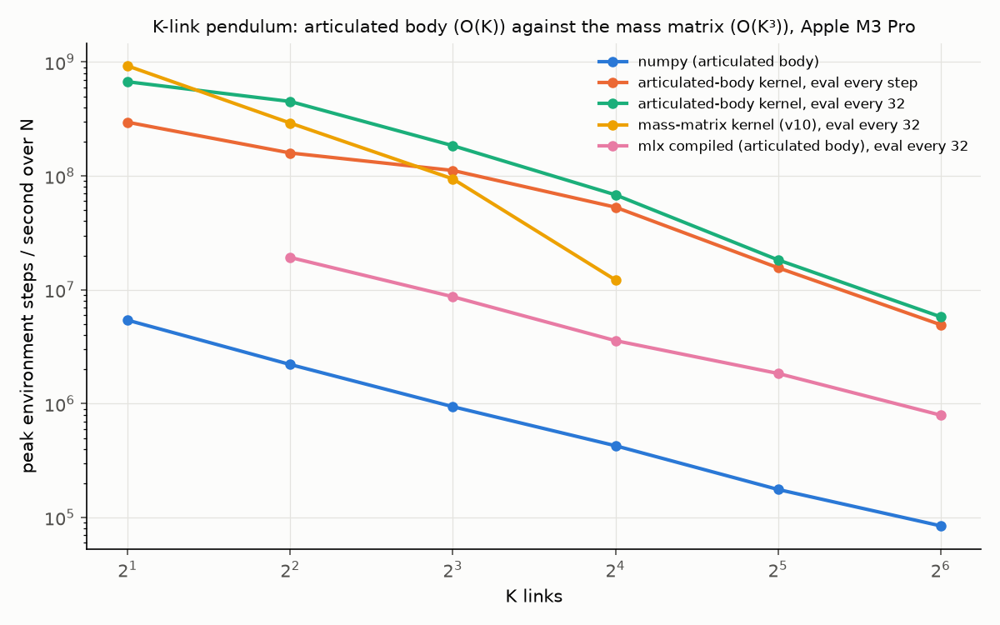

Three passes over the links, each O(1) per link: outward for link
velocities and velocity-product bias forces, inward accumulating each
link's articulated inertia and bias force into its parent, outward again
for accelerations. Planar spatial algebra, 3-vectors and 3×3 inertias,
relative joint coordinates, gravity as a base acceleration. Same three
implementations as before; the numpy and MLX versions share one generic
function, the kernel stores seven floats per link and recomputes the rest.

- **The formulation is the lever.** At K = 16 the O(K) kernel is 5.6x the
  mass-matrix kernel re-run in the same session, at K = 8 2x, at K = 4
  1.55x; at K = 2 it is 0.73x, three passes of 3×3 algebra costing more
  than a 2×2 solve. v10's cooperative solve, trig identity and memory
  placement, all applied to the same O(K³) formulation, moved K = 16 by
  at most a tenth.
- **It scales.** The kernel's peak falls 671M, 450M, 184M, 68M, 18M, 5.8M
  steps per second from K = 2 to 64, flops per step growing exactly
  linearly. Past K = 8 the fall is steeper than the flops, 0.27x to 0.37x
  per doubling against 0.5x, because per-thread state grows with K too,
  about 900 floats at K = 64. At K = 16 the kernel sustains about 600
  GFLOPS of this arithmetic, three times the mass-matrix kernel's; at
  K = 64, about 210.
- **numpy gains from it as well**, 2.3x at K = 16, so the GPU's lead stays
  between 150x and 220x at N = 65,536 up to K = 16 and falls to 118x and
  47x at 32 and 64 as the kernel's occupancy drops. The kernel beats numpy
  at N = 1 for every K: at K = 64 it takes 220 µs per step to numpy's
  11 ms, which is Python overhead across 15,000 array calls, not the CPU.
- **Compiled MLX runs the O(K) formulation at every K but 2**, 5x to 10x
  behind the kernel. At K = 2 the whole step is elementwise, `mx.compile`
  fuses all of it into one Metal kernel, and that kernel needs more
  argument buffers than Metal allows; from K = 4 the stacking ops break the
  fusion into several kernels and it compiles. The sweep probes each K and
  drops the configuration where it fails.
- **Session variance, stated.** The mass-matrix kernel at K = 2 measured
  925M steps per second here and 751M in v10's session, a 23% difference
  for the one configuration that is pure launch overhead. References are
  re-run in-session for this reason; ratios within a table are the
  reliable quantity.

### Tables

Same machine, conditions and parameters as v9 and v10, with K to 64.
`results/aba.csv`; `uv run bench_aba.py` regenerates it in about 35
minutes.

| K | flops / step | numpy (articulated body): peak steps/s | articulated-body kernel, eval every step: peak steps/s | articulated-body kernel, eval every 32: peak steps/s | mass-matrix kernel (v10), eval every 32: peak steps/s | mlx compiled (articulated body), eval every 32: peak steps/s | first N where the O(K) kernel (eval every 32) beats numpy |
|--:|--:|--:|--:|--:|--:|--:|--:|
| 2 | ~1,144 | 5,407,254 | 295,924,921 | 670,932,129 | 924,500,410 | — | 1 |
| 4 | ~2,288 | 2,206,225 | 158,994,349 | 450,437,382 | 291,087,502 | 19,222,042 | 1 |
| 8 | ~4,576 | 940,765 | 111,680,711 | 184,284,347 | 94,146,125 | 8,689,918 | 1 |
| 16 | ~9,152 | 427,281 | 53,120,052 | 68,215,640 | 12,199,473 | 3,576,896 | 1 |
| 32 | ~18,304 | 176,390 | 15,613,636 | 18,300,953 | — | 1,841,996 | 1 |
| 64 | ~36,608 | 84,588 | 4,935,532 | 5,792,501 | — | 793,156 | 1 |

<details><summary>K = 2, per N</summary>

| N | numpy (articulated body) | articulated-body kernel, eval every step | articulated-body kernel, eval every 32 | mass-matrix kernel (v10), eval every 32 | best GPU / numpy |
|--:|--:|--:|--:|--:|--:|
| 1 | 4,074 | 3,934 | 21,423 | 20,523 | 5.26x |
| 2 | 8,084 | 11,292 | 46,614 | 45,639 | 5.77x |
| 4 | 16,140 | 21,325 | 94,818 | 92,081 | 5.87x |
| 8 | 32,246 | 34,288 | 184,851 | 182,672 | 5.73x |
| 16 | 64,619 | 79,625 | 349,021 | 375,740 | 5.81x |
| 32 | 128,013 | 158,951 | 704,436 | 734,719 | 5.74x |
| 64 | 249,933 | 321,670 | 1,376,865 | 1,451,046 | 5.81x |
| 128 | 470,220 | 684,182 | 2,760,069 | 2,888,534 | 6.14x |
| 256 | 843,590 | 1,362,122 | 5,629,192 | 5,791,616 | 6.87x |
| 512 | 1,453,242 | 2,738,216 | 11,048,341 | 11,633,955 | 8.01x |
| 1,024 | 2,474,010 | 5,320,290 | 22,042,799 | 23,148,395 | 9.36x |
| 2,048 | 3,696,977 | 10,647,279 | 41,907,836 | 45,666,379 | 12.35x |
| 4,096 | 4,748,778 | 21,541,583 | 80,959,642 | 90,760,908 | 19.11x |
| 8,192 | 5,407,254 | 42,871,058 | 136,345,468 | 173,912,411 | 32.16x |
| 16,384 | 4,786,600 | 83,369,748 | 224,302,342 | 249,906,402 | 52.21x |
| 32,768 | 4,670,956 | 159,854,563 | 445,121,286 | 371,453,996 | 95.30x |
| 65,536 | 4,589,703 | 295,924,921 | 670,932,129 | 924,500,410 | 201.43x |

</details>

<details><summary>K = 4, per N</summary>

| N | numpy (articulated body) | mlx compiled (articulated body), eval every 32 | articulated-body kernel, eval every step | articulated-body kernel, eval every 32 | mass-matrix kernel (v10), eval every 32 | best GPU / numpy |
|--:|--:|--:|--:|--:|--:|--:|
| 1 | 1,723 | 674 | 3,777 | 14,924 | 15,175 | 8.81x |
| 2 | 3,442 | 1,357 | 8,725 | 31,553 | 32,048 | 9.31x |
| 4 | 6,873 | 2,701 | 17,919 | 53,744 | 67,831 | 9.87x |
| 8 | 13,511 | 5,374 | 29,298 | 94,028 | 138,611 | 10.26x |
| 16 | 26,649 | 10,534 | 68,634 | 185,148 | 273,191 | 10.25x |
| 32 | 53,004 | 20,435 | 144,188 | 374,951 | 524,585 | 9.90x |
| 64 | 105,852 | 38,530 | 272,445 | 871,497 | 983,679 | 9.29x |
| 128 | 198,905 | 74,763 | 555,957 | 1,689,319 | 2,017,630 | 10.14x |
| 256 | 355,371 | 143,973 | 1,101,303 | 3,483,641 | 4,049,056 | 11.39x |
| 512 | 615,041 | 283,396 | 2,307,450 | 6,728,024 | 8,267,874 | 13.44x |
| 1,024 | 1,051,026 | 560,043 | 4,310,834 | 13,677,197 | 16,620,143 | 15.81x |
| 2,048 | 1,521,682 | 1,083,123 | 8,910,123 | 31,041,018 | 30,712,505 | 20.40x |
| 4,096 | 1,876,835 | 2,162,021 | 17,647,250 | 62,864,901 | 62,155,650 | 33.50x |
| 8,192 | 2,206,225 | 4,311,580 | 35,439,730 | 107,413,132 | 115,662,389 | 52.43x |
| 16,384 | 1,575,607 | 7,993,388 | 65,574,595 | 157,474,393 | 180,755,216 | 114.72x |
| 32,768 | 2,082,982 | 16,509,243 | 120,492,503 | 245,527,412 | 238,263,097 | 117.87x |
| 65,536 | 2,115,578 | 19,222,042 | 158,994,349 | 450,437,382 | 291,087,502 | 212.91x |

</details>

<details><summary>K = 8, per N</summary>

| N | numpy (articulated body) | mlx compiled (articulated body), eval every 32 | articulated-body kernel, eval every step | articulated-body kernel, eval every 32 | mass-matrix kernel (v10), eval every 32 | best GPU / numpy |
|--:|--:|--:|--:|--:|--:|--:|
| 1 | 800 | 225 | 3,626 | 11,322 | 8,685 | 14.15x |
| 2 | 1,618 | 415 | 7,786 | 24,702 | 16,683 | 15.27x |
| 4 | 3,218 | 821 | 14,343 | 49,341 | 34,164 | 15.33x |
| 8 | 6,304 | 1,676 | 28,545 | 62,682 | 71,190 | 11.29x |
| 16 | 12,634 | 3,360 | 59,404 | 175,591 | 142,424 | 13.90x |
| 32 | 25,020 | 5,840 | 111,878 | 389,181 | 280,936 | 15.55x |
| 64 | 49,166 | 11,800 | 217,176 | 667,586 | 560,526 | 13.58x |
| 128 | 92,348 | 22,658 | 435,554 | 1,297,160 | 1,122,595 | 14.05x |
| 256 | 160,763 | 46,533 | 953,894 | 2,858,984 | 2,259,979 | 17.78x |
| 512 | 277,045 | 91,224 | 1,743,875 | 5,397,834 | 4,587,910 | 19.48x |
| 1,024 | 452,102 | 180,727 | 3,305,767 | 11,545,142 | 9,153,552 | 25.54x |
| 2,048 | 671,902 | 346,582 | 6,819,829 | 22,145,527 | 18,100,742 | 32.96x |
| 4,096 | 858,259 | 681,389 | 14,523,179 | 45,289,640 | 34,843,167 | 52.77x |
| 8,192 | 940,765 | 1,358,848 | 28,513,801 | 83,058,274 | 65,067,982 | 88.29x |
| 16,384 | 720,690 | 2,888,534 | 49,817,828 | 120,319,692 | 75,869,689 | 166.95x |
| 32,768 | 879,549 | 6,010,189 | 78,410,907 | 165,341,090 | 85,394,864 | 187.98x |
| 65,536 | 927,980 | 8,689,918 | 111,680,711 | 184,284,347 | 94,146,125 | 198.59x |

</details>

<details><summary>K = 16, per N</summary>

| N | numpy (articulated body) | mlx compiled (articulated body), eval every 32 | articulated-body kernel, eval every step | articulated-body kernel, eval every 32 | mass-matrix kernel (v10), eval every 32 | best GPU / numpy |
|--:|--:|--:|--:|--:|--:|--:|
| 1 | 394 | 76 | 3,384 | 10,323 | 2,508 | 26.20x |
| 2 | 786 | 139 | 6,983 | 21,748 | 4,993 | 27.67x |
| 4 | 1,578 | 278 | 13,784 | 41,656 | 10,124 | 26.40x |
| 8 | 3,025 | 657 | 27,257 | 80,582 | 20,376 | 26.64x |
| 16 | 6,271 | 1,545 | 55,493 | 171,289 | 40,504 | 27.31x |
| 32 | 12,439 | 3,721 | 108,364 | 328,109 | 80,451 | 26.38x |
| 64 | 24,312 | 7,792 | 219,765 | 665,448 | 161,824 | 27.37x |
| 128 | 46,542 | 15,034 | 419,933 | 1,355,039 | 319,871 | 29.11x |
| 256 | 81,471 | 29,543 | 840,062 | 2,400,674 | 506,390 | 29.47x |
| 512 | 137,781 | 56,718 | 1,630,337 | 4,973,641 | 1,016,686 | 36.10x |
| 1,024 | 228,097 | 110,402 | 3,153,751 | 9,584,673 | 2,007,338 | 42.02x |
| 2,048 | 349,717 | 211,511 | 6,507,667 | 17,569,288 | 3,843,096 | 50.24x |
| 4,096 | 425,905 | 413,393 | 12,159,000 | 30,426,138 | 6,751,054 | 71.44x |
| 8,192 | 427,281 | 780,006 | 20,648,271 | 48,002,196 | 8,721,460 | 112.34x |
| 16,384 | 287,414 | 1,441,649 | 30,695,870 | 52,591,397 | 10,096,709 | 182.98x |
| 32,768 | 395,936 | 2,726,264 | 40,663,922 | 59,909,000 | 11,285,601 | 151.31x |
| 65,536 | 311,783 | 3,576,896 | 53,120,052 | 68,215,640 | 12,199,473 | 218.79x |

</details>

<details><summary>K = 32, per N</summary>

| N | numpy (articulated body) | mlx compiled (articulated body), eval every 32 | articulated-body kernel, eval every step | articulated-body kernel, eval every 32 | best GPU / numpy |
|--:|--:|--:|--:|--:|--:|
| 1 | 186 | 45 | 2,208 | 6,329 | 34.03x |
| 2 | 373 | 104 | 5,780 | 13,405 | 35.94x |
| 4 | 744 | 209 | 11,981 | 26,393 | 35.47x |
| 8 | 1,461 | 434 | 23,340 | 50,564 | 34.61x |
| 16 | 2,978 | 799 | 45,874 | 103,684 | 34.82x |
| 32 | 5,904 | 1,548 | 93,304 | 210,104 | 35.59x |
| 64 | 11,323 | 3,054 | 182,156 | 415,656 | 36.71x |
| 128 | 21,994 | 5,889 | 364,210 | 735,916 | 33.46x |
| 256 | 38,171 | 11,180 | 651,830 | 1,343,883 | 35.21x |
| 512 | 64,571 | 23,607 | 1,289,567 | 2,658,086 | 41.17x |
| 1,024 | 104,078 | 46,075 | 2,625,299 | 5,348,404 | 51.39x |
| 2,048 | 155,440 | 79,008 | 5,348,086 | 10,468,312 | 67.35x |
| 4,096 | 166,333 | 168,777 | 10,162,869 | 17,206,224 | 103.44x |
| 8,192 | 176,390 | 336,462 | 12,534,629 | 18,300,953 | 103.75x |
| 16,384 | 93,358 | 780,324 | 13,724,779 | 17,483,879 | 187.28x |
| 32,768 | 111,974 | 1,577,566 | 14,893,558 | 17,472,311 | 156.04x |
| 65,536 | 150,518 | 1,841,996 | 15,613,636 | 17,807,725 | 118.31x |

</details>

<details><summary>K = 64, per N</summary>

| N | numpy (articulated body) | mlx compiled (articulated body), eval every 32 | articulated-body kernel, eval every step | articulated-body kernel, eval every 32 | best GPU / numpy |
|--:|--:|--:|--:|--:|--:|
| 1 | 93 | 26 | 2,305 | 4,509 | 48.48x |
| 2 | 186 | 51 | 4,789 | 9,006 | 48.42x |
| 4 | 373 | 103 | 9,677 | 18,079 | 48.47x |
| 8 | 738 | 207 | 18,874 | 34,662 | 46.97x |
| 16 | 1,443 | 419 | 37,647 | 68,875 | 47.73x |
| 32 | 2,910 | 766 | 75,481 | 138,837 | 47.71x |
| 64 | 5,713 | 1,561 | 149,426 | 283,963 | 49.70x |
| 128 | 10,666 | 3,138 | 264,188 | 469,822 | 44.05x |
| 256 | 17,580 | 6,206 | 470,783 | 712,705 | 40.54x |
| 512 | 30,887 | 12,108 | 996,003 | 1,528,088 | 49.47x |
| 1,024 | 51,263 | 23,177 | 1,093,175 | 3,059,184 | 59.68x |
| 2,048 | 63,302 | 44,418 | 1,089,573 | 4,635,990 | 73.24x |
| 4,096 | 70,020 | 86,624 | 4,935,532 | 5,792,501 | 82.73x |
| 8,192 | 77,872 | 181,193 | 3,752,380 | 4,448,651 | 57.13x |
| 16,384 | 48,025 | 388,185 | 3,884,416 | 4,145,115 | 86.31x |
| 32,768 | 54,375 | 648,483 | 3,894,883 | 4,134,353 | 76.03x |
| 65,536 | 84,588 | 793,156 | 3,863,401 | 3,961,767 | 46.84x |

</details>

### v11 methodology

- **Checked against the mass matrix.** The O(K) recursion and the O(K³)
  solve are two derivations of the same equations; the accelerations agree
  to a few parts in a million at every K from 2 to 16 on random folded
  configurations, and the single-link closed form exactly.
- **Past K = 16 there is no oracle**, so energy conservation without torque
  is the check: RK4 at the time step of 0.02 drifts under 1% at K = 16, 3%
  at K = 32 and 10% at K = 64 over ten simulated seconds. The step is too
  coarse for a trustworthy 64-link simulation; it does not change the
  arithmetic per step, which is what the sweep measures.
- **Both ports agree with numpy** to 1e-3 at every K from 2 to 64, and the
  kernel's resets and a 100-step lazy chain are checked as before.
- The flop count is a hand count of about 140 per link per stage and is
  approximate.

## v12: do contacts break the batch?

No. A hopper with one hard contact, solved exactly each substep, steps at
**617M environment steps per second** on the kernel, the same rate as a
body of Acrobot's weight with no contact at all; the kernel beats numpy at
N = 1 by 10x and by 600x at N = 262,144, the widest margin in the project.
And the first genuinely branchy dynamics here, in contact or not, sticking
or sliding, costs nothing on Metal: a kernel that branches on contact and one
that selects are within run-to-run noise in every regime.

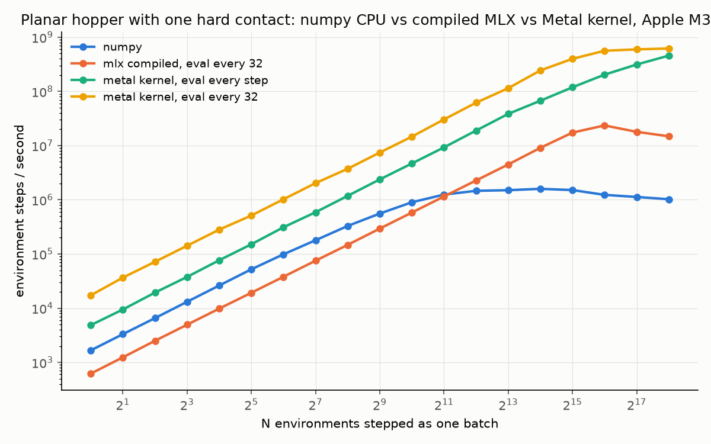

The body: a torso disk with mass and inertia at the hip, a massless leg
with a point-mass foot, four coordinates, a hip torque in three levels as
the action. One contact at the foot against a floor: inelastic in the
normal direction, Coulomb friction in the tangent, the 2×2 contact problem
solved exactly each substep (stick, slide on the cone's edge in the
consistent direction, or separate), Baumgarte stabilisation against
penetration, no penalty springs. Semi-implicit Euler, four substeps of
0.01 per control step, velocities first and impulses applied to the free
velocity, as physics engines do. Same three implementations; the numpy and
MLX versions share one generic substep, the kernel factors the 4×4 mass
matrix once per substep and solves three right-hand sides.

- **Contacts add no disproportionate cost.** About a thousand flops per
  step, four mass matrices, four Cholesky factorisations, twelve solves and
  four contact resolutions, run at 617M steps per second at N = 262,144,
  roughly 600 GFLOPS, the same rate the K = 16 articulated body reached.
  numpy's step is four hundred array calls, 600 µs at N = 1 and a
  memory-bound 1.6M steps per second at its peak, which is why the margins
  are the project's widest.
- **Divergence did not cost.** Two kernels differ only in the contact
  block: `select` computes the impulse for every environment and zeroes it
  when airborne, `branchy` skips it inside `if (touching)`. Timed at
  N = 65,536 with every environment airborne, every environment standing,
  and a random policy that mixes the two:

| kernel | airborne: steps/s | standing: steps/s | mixed: steps/s |
|---|--:|--:|--:|
| select kernel | 260,115,574 | 266,561,351 | 208,511,266 |
| branchy kernel | 266,979,703 | 268,570,996 | 206,965,574 |

  The mixed regime looked 22% slower for both kernels, so a fourth regime
  was run, airborne with random actions: 217M against 261M with a fixed
  action for the select kernel, 244M against 310M for the branchy one. The
  gap is the action draw, one extra random-number kernel per step in a loop
  that syncs every step, not the contact regime. Contact-regime differences
  and the branchy-versus-select difference are both inside the 10% to 15%
  the same cell moves between runs.
- **The physics needed three fixes the tests found.** The sliding direction
  must be chosen by consistency, solving both directions and keeping the one
  whose residual slip opposes the friction, because capping the tangential
  impulse changes the normal one when the contact matrix couples them; the
  first version took the sign from the sticking solution and failed a
  complementarity check on tilted legs. A contact whose free motion already
  separates gets no impulse, the solution an iterative solver reaches from
  zero and the physical one; the exact stick branch can otherwise find a
  second solution where friction drags the foot back down. And the friction
  coefficient is 0.7, not 1.0: at 1.0 the exact solve is ill-posed for 15%
  of random configurations (Painlevé's regime, where the cone is wider than
  the coupling allows); at 0.7 the margin is positive at every leg angle.

### Table

Same machine and conditions, v1's parameters: 256 timed iterations after
16, median of 3, N to 262,144. `results/hopper.csv`;
`uv run bench_hopper.py --max-exp 18` regenerates it and the divergence
experiment in about twenty minutes.

| N | numpy | mlx compiled, eval every 32 | metal kernel, eval every step | metal kernel, eval every 32 | best GPU / numpy |
|--:|--:|--:|--:|--:|--:|
| 1 | 1,665 | 620 | 4,860 | 17,257 | 10.36x |
| 2 | 3,313 | 1,239 | 9,459 | 36,639 | 11.06x |
| 4 | 6,556 | 2,503 | 19,393 | 71,746 | 10.94x |
| 8 | 13,126 | 4,955 | 37,723 | 141,797 | 10.80x |
| 16 | 26,175 | 9,811 | 76,568 | 281,279 | 10.75x |
| 32 | 52,130 | 19,224 | 150,890 | 511,836 | 9.82x |
| 64 | 98,537 | 37,967 | 310,855 | 1,021,184 | 10.36x |
| 128 | 179,095 | 75,087 | 588,612 | 2,028,355 | 11.33x |
| 256 | 328,562 | 147,148 | 1,180,062 | 3,728,597 | 11.35x |
| 512 | 556,602 | 293,973 | 2,374,331 | 7,438,116 | 13.36x |
| 1,024 | 899,534 | 580,690 | 4,672,073 | 14,615,216 | 16.25x |
| 2,048 | 1,246,090 | 1,149,583 | 9,262,527 | 30,374,358 | 24.38x |
| 4,096 | 1,462,638 | 2,271,352 | 18,922,000 | 61,819,275 | 42.27x |
| 8,192 | 1,500,879 | 4,479,257 | 38,411,165 | 114,413,252 | 76.23x |
| 16,384 | 1,592,598 | 9,071,383 | 67,071,796 | 243,209,741 | 152.71x |
| 32,768 | 1,509,757 | 17,335,949 | 118,854,655 | 398,287,942 | 263.81x |
| 65,536 | 1,231,945 | 23,501,907 | 203,526,923 | 561,614,119 | 455.88x |
| 131,072 | 1,125,801 | 17,923,909 | 312,864,754 | 595,339,616 | 528.81x |
| 262,144 | 1,023,476 | 14,828,350 | 456,322,273 | 617,208,169 | 603.05x |

### v12 methodology

- **Physics checked analytically before any parity test**: free flight
  follows the parabola and conserves energy with rotation; a standing body
  does not drift in 400 substeps, the impulse cancelling gravity exactly; a
  dropped body lands without bounce and penetrates less than one substep of
  fall; a sliding foot decelerates under friction and does not with the
  coefficient at zero; and the impulse satisfies the contact laws on 2,000
  random well-posed contact matrices: no pull, the normal velocity at its
  target when pushing, friction in the cone with the foot stuck or on the
  cone's edge opposing the slip.
- **Both ports agree with numpy** to 1e-3 on 500 random states of which
  about half are in contact, including tilted legs and both kernel
  variants; resets and a 100-step lazy chain are checked as before.
- Reward is forward velocity plus one; termination is the torso below 0.6
  or tilted past one radian; reset is the standing pose with noise of 0.05,
  which alone places some feet up to five centimetres below the floor.

## v13: do multiple contacts break the batch?

No, and the iterative solver they need has a measurable price list. A torso
with four legs and four coupled hard contacts, solved by eight projected
Gauss-Seidel sweeps every substep, steps at **24M environment steps per
second** on the kernel, 357x numpy; each doubling of the sweep count halves
the solver's error and costs a fifth to a third of the step.

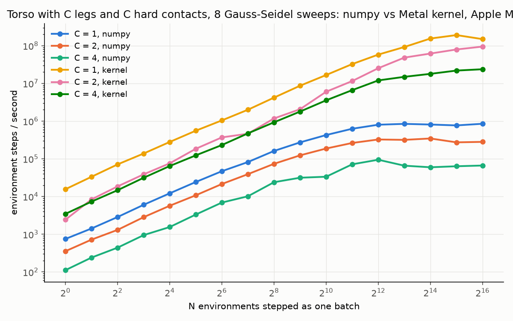

v12's hopper generalised: one torso, C massless legs from the hip with a
foot mass each, 3 + C coordinates, one torque level per leg so 3^C actions,
C contacts. C = 1 is the hopper exactly, and the tests check that it
reproduces v12 to float precision. With more than one contact the contact
problem has no closed form, so it is solved the way GPU physics engines
solve it: block projected Gauss-Seidel, a fixed number of sweeps over the
contacts, each contact solved exactly (v12's solve) given the others'
current impulses. Same three implementations, same tests as v12 where they
apply, and three new ones: two-leg standing that converges with sweeps,
four legs as two coincident pairs (redundant contacts, a singular contact
matrix), and convergence on the states a random policy visits.

- **Cost rises steeply with contacts.** At N = 65,536 the chained kernel
  does 149M steps per second with one leg, 95M with two and 24M with four:
  four times the cost per step for twice the contacts, from the (3+C)²
  mass matrix, 2C + 1 solves, C² contact-matrix blocks and C block solves
  per sweep. numpy's step is thousands of array calls at C = 4 and peaks at
  95K steps per second, so the GPU's lead widens to 357x. The kernel beats
  numpy at N = 1 for every C, by 9x to 31x.
- **Sweeps buy accuracy at a stated price.** Measured at N = 65,536 with the
  chained kernel, and as the creep of a static stand over four seconds,
  which a converged solver leaves at zero:

| sweeps | C = 2: kernel steps/s at N = 65,536 | C = 2: stand creep over 4 s | C = 4: kernel steps/s at N = 65,536 | C = 4: stand creep over 4 s |
|--:|--:|--:|--:|--:|
| 1 | 148,587,531 | 43.81 mm | 27,656,704 | 87.18 mm |
| 2 | 130,199,428 | 30.04 mm | 27,492,110 | 48.52 mm |
| 4 | 130,241,539 | 12.72 mm | 26,196,758 | 15.01 mm |
| 8 | 112,607,332 | 7.51 mm | 24,300,548 | 6.26 mm |
| 16 | 85,876,189 | 3.41 mm | 21,181,268 | 2.76 mm |
| 32 | 58,376,177 | 1.79 mm | 17,752,265 | 1.83 mm |

  Two legs from one hip are strongly coupled contacts and the error falls
  like one over the sweep count: 44 mm of creep at one sweep, 7.5 mm at the
  default eight, 1.8 mm at thirty-two, for 2.5x the step's cost from one
  sweep to thirty-two. The four-leg column is two coincident leg pairs, a
  singular contact matrix; it converges the same way but never fully, about
  a millimetre remaining at 256 sweeps against nothing for two independent
  contacts, and its sweeps are a smaller share of a step that the mass
  matrix dominates.
- **On the states an agent visits, convergence is geometric with rare
  stalls.** Against a 1,024-sweep reference the 99th-percentile velocity
  error after eight sweeps is 0.04, after sixteen 0.003, after thirty-two
  under 0.001; one state in four hundred, a near-redundant pair of feet,
  stalls at 0.09 even between 256 and 1,024 sweeps. That is how fixed-sweep
  solvers behave in engines, and the tests assert the percentiles and bound
  the stall fraction rather than the maximum.
- **Generality costs when the contact count is one.** The hopper through
  this solver at eight sweeps runs at 149M steps per second where v12's
  exact kernel ran at 562M at the same N: 3.8x for sweeps that a single
  contact does not need. The sweep count should follow the contact count.

### Tables

Same machine and conditions, v9's parameters: 64 timed iterations after 8,
median of 3, N to 65,536, eight sweeps. `results/legged.csv`;
`uv run bench_legged.py` regenerates the sweep and the study in about
45 minutes, `--only-study` the study alone.

<details><summary>C = 1 legs, per N</summary>

| N | numpy | mlx compiled, eval every 32 | metal kernel, eval every step | metal kernel, eval every 32 | best GPU / numpy |
|--:|--:|--:|--:|--:|--:|
| 1 | 752 | 625 | 4,604 | 15,667 | 20.83x |
| 2 | 1,424 | 1,240 | 9,141 | 33,461 | 23.50x |
| 4 | 2,868 | 2,542 | 18,205 | 71,182 | 24.82x |
| 8 | 6,045 | 4,913 | 33,624 | 138,453 | 22.90x |
| 16 | 12,190 | 9,789 | 68,155 | 280,199 | 22.99x |
| 32 | 24,322 | 19,191 | 136,160 | 556,799 | 22.89x |
| 64 | 46,979 | 37,825 | 273,430 | 1,044,454 | 22.23x |
| 128 | 82,222 | 74,255 | 539,234 | 2,003,832 | 24.37x |
| 256 | 161,632 | 145,507 | 1,095,087 | 4,193,767 | 25.95x |
| 512 | 273,007 | 293,796 | 2,207,082 | 8,672,224 | 31.77x |
| 1,024 | 427,187 | 560,567 | 4,127,927 | 16,666,637 | 39.01x |
| 2,048 | 627,199 | 1,098,365 | 8,776,139 | 32,522,052 | 51.85x |
| 4,096 | 802,077 | 2,147,534 | 16,802,666 | 58,013,043 | 72.33x |
| 8,192 | 845,107 | 4,193,295 | 32,296,671 | 92,173,738 | 109.07x |
| 16,384 | 811,240 | 8,389,374 | 55,601,809 | 154,697,157 | 190.69x |
| 32,768 | 769,339 | 15,691,652 | 88,069,531 | 190,938,047 | 248.18x |
| 65,536 | 850,377 | 22,671,071 | 132,826,766 | 149,103,862 | 175.34x |

</details>

<details><summary>C = 2 legs, per N</summary>

| N | numpy | mlx compiled, eval every 32 | metal kernel, eval every step | metal kernel, eval every 32 | best GPU / numpy |
|--:|--:|--:|--:|--:|--:|
| 1 | 356 | 132 | 3,257 | 2,435 | 9.15x |
| 2 | 721 | 235 | 5,783 | 8,406 | 11.66x |
| 4 | 1,308 | 471 | 11,315 | 18,566 | 14.19x |
| 8 | 2,840 | 912 | 8,919 | 38,825 | 13.67x |
| 16 | 5,702 | 1,696 | 12,466 | 76,035 | 13.33x |
| 32 | 10,804 | 2,937 | 47,457 | 184,627 | 17.09x |
| 64 | 21,488 | 6,224 | 89,593 | 370,299 | 17.23x |
| 128 | 39,208 | 11,848 | 149,297 | 463,105 | 11.81x |
| 256 | 73,741 | 23,104 | 239,011 | 1,174,933 | 15.93x |
| 512 | 123,613 | 48,542 | 584,079 | 2,069,765 | 16.74x |
| 1,024 | 187,502 | 90,868 | 1,220,992 | 6,011,558 | 32.06x |
| 2,048 | 263,350 | 175,164 | 2,737,918 | 11,531,980 | 43.79x |
| 4,096 | 325,701 | 345,244 | 5,533,125 | 25,270,952 | 77.59x |
| 8,192 | 318,158 | 677,099 | 20,034,602 | 48,248,289 | 151.65x |
| 16,384 | 346,348 | 1,332,811 | 33,478,993 | 61,819,883 | 178.49x |
| 32,768 | 273,551 | 2,663,033 | 45,995,219 | 79,330,900 | 290.00x |
| 65,536 | 281,436 | 4,925,765 | 62,579,563 | 94,601,960 | 336.14x |

</details>

<details><summary>C = 4 legs, per N</summary>

| N | numpy | mlx compiled, eval every 32 | metal kernel, eval every step | metal kernel, eval every 32 | best GPU / numpy |
|--:|--:|--:|--:|--:|--:|
| 1 | 112 | 53 | 2,085 | 3,477 | 31.04x |
| 2 | 241 | 104 | 4,178 | 7,350 | 30.50x |
| 4 | 442 | 210 | 8,563 | 14,729 | 33.32x |
| 8 | 949 | 430 | 18,459 | 31,492 | 33.18x |
| 16 | 1,556 | 835 | 36,666 | 64,363 | 41.36x |
| 32 | 3,330 | 1,671 | 72,910 | 123,609 | 37.12x |
| 64 | 6,925 | 3,281 | 145,981 | 231,931 | 33.49x |
| 128 | 10,169 | 6,682 | 281,548 | 473,290 | 46.54x |
| 256 | 23,977 | 12,743 | 535,412 | 929,512 | 38.77x |
| 512 | 31,565 | 24,695 | 1,024,418 | 1,790,569 | 56.73x |
| 1,024 | 33,516 | 42,832 | 2,131,492 | 3,555,524 | 106.08x |
| 2,048 | 71,579 | 83,897 | 4,091,631 | 6,623,534 | 92.53x |
| 4,096 | 94,593 | 176,351 | 8,444,874 | 11,994,372 | 126.80x |
| 8,192 | 65,805 | 355,558 | 12,336,865 | 14,924,773 | 226.80x |
| 16,384 | 59,705 | 534,232 | 14,646,195 | 17,904,839 | 299.89x |
| 32,768 | 63,549 | 1,231,973 | 18,408,194 | 21,876,344 | 344.24x |
| 65,536 | 66,410 | 1,647,529 | 21,022,759 | 23,727,258 | 357.28x |

</details>

### v13 methodology

- **The solver is v12's exact single-contact solve applied per block**, so
  every property that held for one contact holds for each block given the
  others; the fixed sweep count and the fixed contact order are the only
  new choices, and both are what engines use on GPUs.
- **Accuracy is measured two ways**: the creep of a true static pose over
  400 substeps with no torque, which isolates the solver's residual from
  dynamics, and the velocity error against a 1,024-sweep reference on 400
  states reached by a random policy. The reset pose is not the static one
  for C = 4, since its outer legs hang in the air on free joints; the static
  pose splays the legs to ±0.25 rad, which at four legs means two coincident
  pairs.
- **Both ports agree with numpy** to 1e-3 on 300 random states per C with a
  third to a half of the feet in contact, and the kernel's resets and a
  100-step lazy chain are checked at C = 4.
- The plot shows numpy and the chained kernel only, for legibility; the
  compiled MLX and eager kernel rows are in the tables and the CSV.

## v14: can the learner learn to walk?

The four-legged body, yes: **half the seeds learn a gait within two
minutes**, 0.2 m/s sustained for the whole horizon without a fall, in 200
to 500 generations on the fused kernel with the contact physics inline. The
biped, no: every run at every population converges within a generation to
standing still and never leaves it. The difference is the reward and the
body, not the learner, and not the batch.

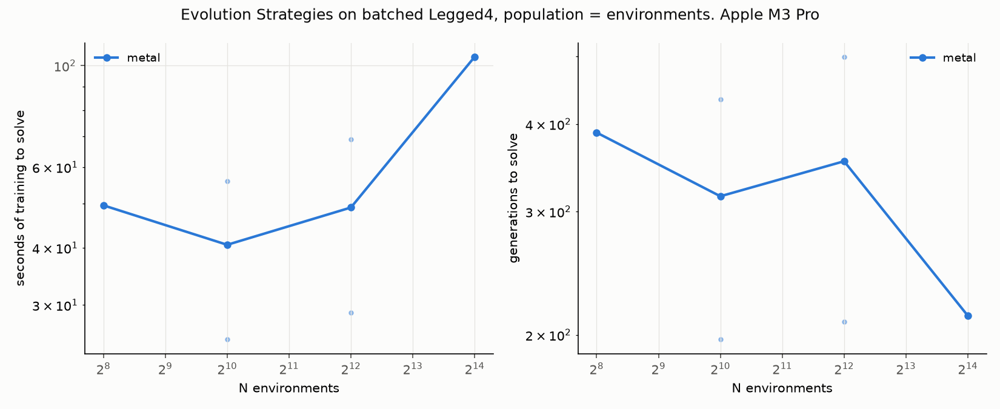

v7's Evolution Strategies with the rollout fused into one kernel, as on
CartPole and Acrobot, now carrying v13's contact solver: each thread runs
its member's policy, one three-way torque head per leg, and the four
substeps of mass matrix, Cholesky and block Gauss-Seidel for the horizon,
accumulating the environment's reward, forward velocity plus one per step,
until the body falls. Fitness is the reward sum on every task now, which
makes CartPole and Acrobot the same rule with their thresholds unchanged.
Hidden width sixteen on the legged bodies, so a four-leg thread's weights
and physics stay under the 4 KB private-memory limit. Three seeds, the
kernel backend, a 120 s budget; the MLX loop backend at one population as
a same-session reference. The walking threshold is a score of 600: the
alive bonus of 500 plus a forward pace of 0.2 m/s for the full horizon.

- **The biped stands and never walks.** Twelve of twelve runs, from 256 to
  16,384 members, reach a score of 500.7 within a generation and hold it
  for all 500 generations: the alive bonus for standing, almost no forward
  motion. Any perturbation that moves the body risks the fall that forfeits
  the bonus, so rank normalisation pushes only toward not falling. The MLX
  loop backend reproduces the same scores to the step at 1.8x the kernel's
  time.
- **The quadruped walks.** Six of twelve runs reach the threshold, in 197
  to 499 generations and 25 to 105 seconds; the medians sit at 595 to 600
  for 256 to 4,096 members, and at 16,384 the budget cuts runs off at
  213 to 276 generations rather than the landscape. Four legs can shift
  weight and shuffle forward without leaving the standing basin; two legs
  from one hip cannot move without risking the fall.
- **Removing the alive bonus frees the biped and exposes the next trap.**
  With fitness as forward velocity alone, threshold 100 for the same pace,
  one biped seed in six walks, three settle into a shuffle at a score of
  44, and two dive: a lunge and a fall within a few steps, which is why
  those runs used a twentieth of the environment steps. On the quadruped
  two seeds in six walk, two shuffle, and two stall at a score of one,
  falling at once from the first generation on, where every perturbation
  of a falling policy also falls and the ranks carry no gradient.
- **The environment is consumed.** The biped kernel runs 79M useful
  environment steps per second at 16,384 members, the quadruped 16M with
  its eight Gauss-Seidel sweeps per substep, all of it inside the learner's
  inner loop: 4 billion contact-physics steps in 52 seconds of training.

### Tables

Seconds are training time, median over solved seeds; the score tables give
the median and best final score of the mean policy over all seeds, solved or
not, which is the number that matters where the threshold is not reached.
`uv run bench_es.py --task legged2 --backends metal --ns 256 1024 4096 16384 --seeds 0 1 2 --time-budget 120`
and the same for `legged4`, `legged2_distance` and `legged4_distance`
regenerate them. The four-leg distance sweep finished after the machine had
gone to battery; its scores and generation counts are deterministic per
seed and unaffected, its seconds may be slow.

Biped, reward with alive bonus:

| N | metal: s to solve | metal: generations to solve | solved |
|--:|--:|--:|--:|
| 256 | — | — | 0/3 |
| 1,024 | — | — | 0/3 |
| 4,096 | — | — | 0/3 |
| 16,384 | — | — | 0/3 |

| P | metal: env steps / s |
|--:|--:|
| 256 | 3.6M |
| 1,024 | 14.3M |
| 4,096 | 56.1M |
| 16,384 | 78.7M |

| P | metal: median final score | metal: best seed |
|--:|--:|--:|
| 256 | 501 | 501 |
| 1,024 | 501 | 501 |
| 4,096 | 501 | 501 |
| 16,384 | 501 | 501 |

Biped on the MLX loop backend, same seeds:

| P | mlx: median final score | mlx: best seed |
|--:|--:|--:|
| 256 | 501 | 501 |

Quadruped, reward with alive bonus:

| N | metal: s to solve | metal: generations to solve | solved |
|--:|--:|--:|--:|
| 256 | 49.5 | 389 | 1/3 |
| 1,024 | 40.6 | 316 | 2/3 |
| 4,096 | 49 | 354 | 2/3 |
| 16,384 | 105 | 213 | 1/3 |

| P | metal: env steps / s |
|--:|--:|
| 256 | 0.9M |
| 1,024 | 3.7M |
| 4,096 | 13.8M |
| 16,384 | 15.8M |

| P | metal: median final score | metal: best seed |
|--:|--:|--:|
| 256 | 595 | 600 |
| 1,024 | 600 | 602 |
| 4,096 | 600 | 601 |
| 16,384 | 569 | 601 |

Biped, forward velocity alone:

| N | metal: s to solve | metal: generations to solve | solved |
|--:|--:|--:|--:|
| 1,024 | 16.3 | 459 | 1/3 |
| 4,096 | — | — | 0/3 |

| P | metal: median final score | metal: best seed |
|--:|--:|--:|
| 1,024 | 44 | 102 |
| 4,096 | 43 | 44 |

Quadruped, forward velocity alone:

| N | metal: s to solve | metal: generations to solve | solved |
|--:|--:|--:|--:|
| 1,024 | 47.4 | 365 | 1/3 |
| 4,096 | 45.7 | 320 | 1/3 |

| P | metal: median final score | metal: best seed |
|--:|--:|--:|
| 1,024 | 25 | 100 |
| 4,096 | 25 | 100 |

### v14 methodology

- **The fused kernel agrees with the step-by-step loop** on reward sum and
  step count for over 95% of a random population on every task, the legged
  ones included, from the same initial states; chaotic trajectories account
  for the rest. The distance-only fitness is checked the same way.
- **Nothing was tuned for the legged bodies.** Step size, noise scale,
  horizon and the ES machinery are v7's; the hidden width is sixteen for the
  memory reason above; the thresholds are stated pace targets, not tuned
  numbers.
- The episode ends at the first fall, so a member's steps and reward stop
  there; an episode that never falls runs the full 500-step horizon.

## v15: can reward shaping get the biped walking?

Not with any shaping tried, and the failure has a shape of its own. Across
42 runs under seven rewards, two bipeds walked. Every reward lands the biped
on one of three attractors: **standing** under any reward in which a fall
costs more than standing, **a shuffle** at a fixed score of 44 under
rewards in which it does not, and **a dive** when exploration is widened.
The quadruped under the same small bonus walks in a third of its seeds.
What a reward can do is decided by the body.

The learner, body and kernel are v14's; only the training reward changes,
and the score used for "solved" is now the same for every variant: the
greedy policy's forward distance until its first fall, threshold 100 for a
walk of 0.2 m/s across the full horizon, under which standing scores 0 and
a dive scores about 11. Six runs per reward, populations of 1,024 and
4,096, three seeds each, 120 s of training. The outcomes are deterministic
per seed; the whole sweep ran on battery, so its seconds and throughput are
not reported.

| training reward | walked | median score | best | outcomes | generations to walk |
|---|--:|--:|--:|---|--:|
| alive bonus 1 per step (v14) | 0/6 | 1 | 1 | 6 stand | — |
| forward velocity alone (v14) | 1/6 | 44 | 102 | 3 shuffle, 2 dive, 1 walk | 459 |
| alive bonus 0.1 | 0/6 | 1 | 1 | 6 stand | — |
| velocity, penalty 20 at a fall | 0/6 | 1 | 1 | 6 stand | — |
| alive bonus 0.1 and the fall penalty | 0/6 | 1 | 1 | 6 stand | — |
| velocity only while the torso is above 0.85 | 1/6 | 44 | 101 | 4 shuffle, 1 dive, 1 walk | 128 |
| velocity alone, noise scale 0.3 | 0/6 | 11 | 11 | 6 dive | — |
| quadruped, alive bonus 0.1 | 2/6 | 74 | 101 | 3 shuffle, 2 walk, 1 stand | 220, 390 |

- **Any cost to falling produces standing.** An alive bonus a tenth the
  size of v14's, a penalty of 20 at the fall with no bonus at all, and the
  two combined each leave all six runs standing for 500 generations at a
  score under one. The bonus's size is not the mechanism; its existence is.
  From the standing basin almost every perturbation that moves the body
  falls and forfeits what standing keeps, so the ranked gradient points at
  not moving whatever not moving is worth.
- **No cost to falling produces the shuffle or the dive.** Under forward
  velocity alone, and under velocity gated on the torso staying up, the
  same two failure modes appear with one walker in six: a shuffle that
  scores 44 every time, a gait at under a tenth of a metre per second that
  survives the horizon, and a lunge that falls within a few steps. The gate
  reduced dives from two to one and moved nothing else. The one gated
  walker took 128 generations and four seconds; the one under plain
  velocity, 459.
- **Wider exploration finds the dive every time.** With the perturbation
  scale tripled, all six runs converge to the lunge at a score of 11: the
  larger steps reach the cliff on the moving side before they reach the
  gait.
- **The quadruped is a different problem.** Under the small bonus that
  froze the biped it walks in two seeds of six, with the others spread
  from a shuffle to a near-walk, the same rate as v14's full bonus. Four
  legs can move without leaving the standing basin; two from one hip
  cannot, and no scalar reward tried changes that geometry.

### v15 methodology

- **The canonical score is independent of the training reward**: forward
  distance until the first fall, evaluated on 2,048 fresh episodes of the
  greedy mean policy every generation, outside the clock. A test checks
  that a standing policy scores near zero under it and that a shaped
  variant's fused kernel agrees with the step-by-step loop.
- **The training reward is forward velocity plus a per-step bonus, minus a
  penalty once at a fall, with an optional gate on torso height**, all
  template constants of the rollout kernel and parameters of the loop
  backends, so the same population evaluates identically on either.
- Nothing else changed: v7's step size and noise scale except in the
  noise-scale variant, hidden width sixteen, the 500-step horizon.
- The two v14 rewards were re-run in this session as references and
  reproduced v14's outcomes seed for seed.

## Reproduce

```
uv sync
uv run python test_cartpole.py && uv run python test_acrobot.py && uv run python test_pendulum.py && uv run python test_pendulum_aba.py && uv run python test_hopper.py && uv run python test_legged.py && uv run python test_ppo.py && uv run python test_dqn.py && uv run python test_es.py
uv run bench.py        # v1: environment throughput sweep, ~3 min
uv run bench_ppo.py    # v2: PPO wall-clock to solve sweep, ~6 min
uv run bench_kernel.py # v3: Metal kernel vs compiled step, ~3 min
uv run bench_acrobot.py --max-exp 18  # v4: the heavier body, ~4 min
uv run bench_lr.py     # v5: hyperparameter rules against N in PPO, ~40 min
uv run bench_dqn.py    # v6: DQN, environment on GPU vs CPU, ~20 min
uv run bench_es.py     # v7: Evolution Strategies on three backends, ~45 min
uv run bench_es.py --task acrobot --time-budget 300  # v8: the same on Acrobot, ~25 min
uv run bench_pendulum.py  # v9/v10: the K-link pendulum, body size as the axis, ~50 min
uv run bench_aba.py       # v11: the articulated-body formulation to K = 64, ~35 min
uv run bench_hopper.py --max-exp 18  # v12: the hopper with one hard contact, ~20 min
uv run bench_legged.py    # v13: C legs and C contacts, block Gauss-Seidel, ~45 min
uv run bench_es.py --task legged4 --backends metal --ns 256 1024 4096 16384 --seeds 0 1 2 --time-budget 120  # v14
uv run bench_es.py --task legged2_gated --backends metal --ns 1024 4096 --seeds 0 1 2 --time-budget 120     # v15, one variant
uv run ppo.py --n 256  # one PPO run with a per-iteration log
```

## Layout

- `cartpole_np.py`: the reference dynamics and CPU baseline. Read this first.
- `cartpole_mlx.py`: the same code on MLX, plus the compiled step and the
  one MLX-specific trap (compile freezes the global PRNG key unless it is
  declared as an input and output).
- `cartpole_metal.py`: the step as one hand-written Metal kernel, with its
  in-kernel random resets. Read after the MLX module.
- `test_cartpole.py`: contract tests for all three implementations, including
  agreement with a scalar transcription of Gym's CartPole step and parity of
  MLX and Metal against numpy.
- `bench.py`: the sweep, the timing rule, the CSV, the plot, the table.
- `ppo.py`: PPO on the batched environment, with the environment on either
  device. Read after the two environment files.
- `bench_ppo.py`: the v2 sweep, plot and table.
- `bench_kernel.py`: the v3 sweep, reusing the v1 harness.
- `acrobot_np.py`, `acrobot_mlx.py`, `acrobot_metal.py`, `test_acrobot.py`,
  `bench_acrobot.py`: v4, the same three implementations, tests and sweep
  for the heavier body.
- `bench_lr.py`: v5, hyperparameter rules against N, plus the two
  diagnostic arms, all as configurations of `ppo.py`.
- `dqn.py`, `test_dqn.py`, `bench_dqn.py`: v6, DQN with the replay buffer
  on the GPU, its tests, and the sweep with a batch-size axis.
- `pendulum_np.py`, `pendulum_mlx.py`, `pendulum_metal.py`,
  `pendulum_metal_coop.py`, `test_pendulum.py`, `bench_pendulum.py`: v9 and
  v10, the K-link pendulum in all three implementations plus the
  SIMD-cooperative kernel, its oracle, energy and parity tests, and the
  sweep with body size as the axis.
- `pendulum_aba_np.py`, `pendulum_aba_mlx.py`, `pendulum_aba_metal.py`,
  `test_pendulum_aba.py`, `bench_aba.py`: v11, the same body by
  Featherstone's articulated-body algorithm in all three implementations,
  checked against the mass-matrix version, and its sweep to K = 64.
- `hopper_np.py`, `hopper_mlx.py`, `hopper_metal.py`, `test_hopper.py`,
  `bench_hopper.py`: v12, a planar hopper with one hard contact in all three
  implementations, the select and branchy kernels, the analytic physics
  tests, and the sweep with the divergence experiment.
- `legged_np.py`, `legged_mlx.py`, `legged_metal.py`, `test_legged.py`,
  `bench_legged.py`: v13, a torso with C legs and C hard contacts solved by
  block Gauss-Seidel, in all three implementations, with convergence and
  redundant-contact tests and the sweep with the iteration study.
- `legged_rollout_metal.py`: v14, the ES rollout on the legged body as one
  kernel, policy and contact physics inline; the legged tasks live in
  `es.py`, whose fitness is now the environment's reward sum everywhere,
  and whose v15 variants shape that reward with a per-step bonus, a fall
  penalty and a height gate, all evaluated on one canonical score.
- `es.py`, `cartpole_rollout_metal.py`, `acrobot_rollout_metal.py`,
  `test_es.py`, `bench_es.py`: v7 and v8, Evolution Strategies on three
  backends for either task, the two whole-rollout kernels, tests including
  kernel-versus-loop agreement on both bodies, and the sweep with task and
  step-size axes.
- `test_ppo.py`: GAE against a scalar reference, log-prob and entropy against
  numpy, and one short end-to-end learning check.
- `results/`: CSVs and plots from the runs above, and the first v1 sweep with
  the (N, 4) layout for comparison.

## Scope

v1: one environment, two implementations, one throughput sweep. v2: PPO on
it, environment on either device, wall-clock to solve. v3: the step as one
hand-written Metal kernel against the compiled step. v4: the same three
implementations on a body with eight times the arithmetic. v5: the standard
hyperparameter rules against N in PPO, and two diagnostics for why none of
them work. v6: DQN, the off-policy learner, with a batch-size diagnostic.
v7: Evolution Strategies with the whole rollout as one kernel, the learner
that consumes the environment. v8: the same on Acrobot. v9: a K-link
pendulum with body size as the knob, to a hundred times CartPole's
arithmetic. v10: a SIMD-cooperative solve for it, which wins only with few
environments. v11: the O(K) articulated-body formulation, which wins
outright. v12: a hopper with one hard contact, and the finding that
branching on it costs nothing. v13: C legs and C contacts through a
fixed-sweep Gauss-Seidel solver, with its price list. v14: the ES learner on
those bodies, which walks on four legs and stands on two. v15: seven
rewards for the biped, none of which changes that. Each shipped complete.
Not here: a curriculum or a different learner for the biped, three
dimensions, anything beyond one machine.
